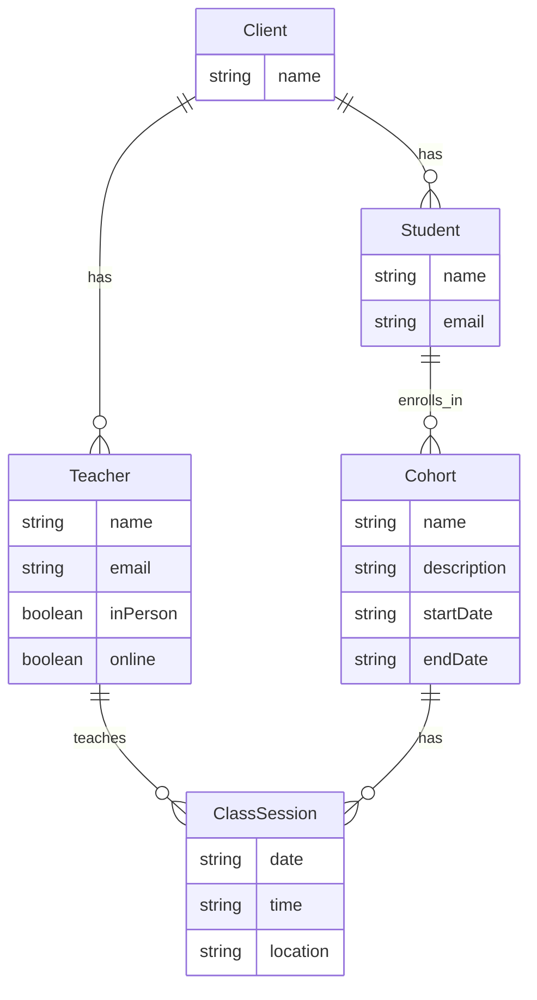

# Product Context

This file provides a high-level overview of the project and the expected product that will be created. Initially it is based upon projectBrief.md (if provided) and all other available project-related information in the working directory. This file is intended to be updated as the project evolves, and should be used to inform all other modes of the project's goals and context.
Timestamp: YYYY-MM-DD HH:MM:SS - Log of updates made will be appended as footnots to the end of this file.

*

## Project Goal

*

## Key Features

*

## Overall Architecture

Timestamp: 2024-07-28 08:56:52 - Added detailed plan for developing the web application.

## Detailed Plan

1.  **Data Model:**
    *   The core entities will likely include:
        *   `Client`: Represents the client (e.g., "French Language School").
        *   `Teacher`: Represents a teacher.
        *   `Student`: Represents a student.
        *   `Cohort`: Represents a group cohort of students.
        *   `ClassSession`: Represents a single class session.
    *   Relationships:
        *   A `Client` has many `Teacher`s.
        *   A `Client` has many `Student`s.
        *   A `Teacher` can teach many `ClassSession`s.
        *   A `Student` can enroll in many `Cohort`s.
        *   A `Cohort` has many `ClassSession`s.
        *   A `ClassSession` has one `Teacher`.
        *   A `ClassSession` belongs to one `Cohort`.

2.  **UI Components:**
    *   Input Area: A text area where the user can input the client description.
    *   Clarification Chat: A chat window where the AI asks clarifying questions and the user provides answers.
    *   Database Understanding: A section that displays the AI's understanding of the database tables and relationships.
    *   Workflows List: A section that displays the AI's list of workflows, sorted by table/entity.
    *   Airtable JSON: A section that displays the generated Airtable API JSON.

3.  **AI Role:**
    *   The AI will use the Gemini 2.0 Flash model to:
        *   Understand the client description and identify the relevant entities and relationships.
        *   Ask clarifying questions to fill in any missing information.
        *   Generate the database schema based on the identified entities and relationships.
        *   Generate the list of workflows based on the database schema.
        *   Generate the Airtable API JSON.

4.  **Workflow Generation:**
    *   The AI will generate workflows for each entity, including:
        *   Adding a new entity.
        *   Modifying an existing entity.
        *   Deleting an entity.
        *   Listing all entities.
        *   Searching for entities.
    *   The AI will also generate workflows for relationships, including:
        *   Adding a new relationship.
        *   Modifying an existing relationship.
        *   Deleting an existing relationship.

5.  **Airtable API JSON Generation:**
    *   The AI will generate the Airtable API JSON based on the database schema.
    *   The JSON will include the necessary information to create the tables and relationships in Airtable.
    *   The JSON will be directly executable.

6.  **Technology Stack:**
    *   Next.js
    *   Tailwind CSS
    *   Shadcn
    *   @google/generative-ai

7.  **Deployment:**
    *   Vercel

8.  **Mermaid Diagram:**



9.  **Next Steps:**
    *   Create the UI components.
    *   Implement the AI logic.
    *   Generate the database schema and workflows.
    *   Generate the Airtable API JSON.
    *   Test the application.
    *   Deploy the application to Vercel.
*

## Project Goal

*

## Key Features

*

## Overall Architecture

Timestamp: 2024-07-28 10:33:33 - Updated product context to reflect the implemented web application.

*   The application generates database schemas and workflows based on user input.
*   The application uses the Gemini 2.0 Flash model to analyze the input and generate the database schema, workflows, and Airtable API JSON.
*   The UI is built with Next.js, Tailwind CSS, and Shadcn.
*   The Airtable API JSON includes linked fields to represent relationships between tables.
*

## Key Features


*   The application takes a text description of the client's business requirements as input.
*   The application displays the AI's understanding of the database tables and relationships.
*   The application generates a list of workflows for each entity.
*   The application generates Airtable API JSON to create the tables and relationships in Airtable.
*

## Overall Architecture

Timestamp: 2024-07-28 08:56:52 - Added detailed plan for developing the web application.

## Detailed Plan

1.  **Data Model:**
    *   The core entities will likely include:
        *   `Client`: Represents the client (e.g., "French Language School").
        *   `Teacher`: Represents a teacher.
        *   `Student`: Represents a student.
        *   `Cohort`: Represents a group cohort of students.
        *   `ClassSession`: Represents a single class session.
    *   Relationships:
        *   A `Client` has many `Teacher`s.
        *   A `Client` has many `Student`s.
        *   A `Teacher` can teach many `ClassSession`s.
        *   A `Student` can enroll in many `Cohort`s.
        *   A `Cohort` has many `ClassSession`s.
        *   A `ClassSession` has one `Teacher`.
        *   A `ClassSession` belongs to one `Cohort`.

2.  **UI Components:**
    *   Input Area: A text area where the user can input the client description.
    *   Clarification Chat: A chat window where the AI asks clarifying questions and the user provides answers.
    *   Database Understanding: A section that displays the AI's understanding of the database tables and relationships.
    *   Workflows List: A section that displays the AI's list of workflows, sorted by table/entity.
    *   Airtable JSON: A section that displays the generated Airtable API JSON.

3.  **AI Role:**
    *   The AI will use the Gemini 2.0 Flash model to:
        *   Understand the client description and identify the relevant entities and relationships.
        *   Ask clarifying questions to fill in any missing information.
        *   Generate the database schema based on the identified entities and relationships.
        *   Generate the list of workflows based on the database schema.
        *   Generate the Airtable API JSON.

4.  **Workflow Generation:**
    *   The AI will generate workflows for each entity, including:
        *   Adding a new entity.
        *   Modifying an existing entity.
        *   Deleting an entity.
        *   Listing all entities.
        *   Searching for entities.
    *   The AI will also generate workflows for relationships, including:
        *   Adding a new relationship.
        *   Modifying an existing relationship.
        *   Deleting an existing relationship.

5.  **Airtable API JSON Generation:**
    *   The AI will generate the Airtable API JSON based on the database schema.
    *   The JSON will include the necessary information to create the tables and relationships in Airtable.
    *   The JSON will be directly executable.

6.  **Technology Stack:**
    *   Next.js
    *   Tailwind CSS
    *   Shadcn
    *   @google/generative-ai

7.  **Deployment:**
    *   Vercel

8.  **Mermaid Diagram:**


9.  **Next Steps:**
    *   Create the UI components.
    *   Implement the AI logic.
    *   Generate the database schema and workflows.
    *   Generate the Airtable API JSON.
    *   Test the application.
    *   Deploy the application to Vercel.
*

## Project Goal

*

## Key Features

*

## Overall Architecture

Timestamp: 2024-07-28 16:37:21 - Updated product context to reflect the changes to the title and h1 tags.

*   The title tag and h1 tag have been updated to "Airtable Database Schema Generator".
*

## Overall Architecture

Timestamp: 2024-07-28 08:56:52 - Added detailed plan for developing the web application.

## Detailed Plan

1.  **Data Model:**
    *   The core entities will likely include:
        *   `Client`: Represents the client (e.g., "French Language School").
        *   `Teacher`: Represents a teacher.
        *   `Student`: Represents a student.
        *   `Cohort`: Represents a group cohort of students.
        *   `ClassSession`: Represents a single class session.
    *   Relationships:
        *   A `Client` has many `Teacher`s.
        *   A `Client` has many `Student`s.
        *   A `Teacher` can teach many `ClassSession`s.
        *   A `Student` can enroll in many `Cohort`s.
        *   A `Cohort` has many `ClassSession`s.
        *   A `ClassSession` has one `Teacher`.
        *   A `ClassSession` belongs to one `Cohort`.

2.  **UI Components:**
    *   Input Area: A text area where the user can input the client description.
    *   Clarification Chat: A chat window where the AI asks clarifying questions and the user provides answers.
    *   Database Understanding: A section that displays the AI's understanding of the database tables and relationships.
    *   Workflows List: A section that displays the AI's list of workflows, sorted by table/entity.
    *   Airtable JSON: A section that displays the generated Airtable API JSON.

3.  **AI Role:**
    *   The AI will use the Gemini 2.0 Flash model to:
        *   Understand the client description and identify the relevant entities and relationships.
        *   Ask clarifying questions to fill in any missing information.
        *   Generate the database schema based on the identified entities and relationships.
        *   Generate the list of workflows based on the database schema.
        *   Generate the Airtable API JSON.

4.  **Workflow Generation:**
    *   The AI will generate workflows for each entity, including:
        *   Adding a new entity.
        *   Modifying an existing entity.
        *   Deleting an entity.
        *   Listing all entities.
        *   Searching for entities.
    *   The AI will also generate workflows for relationships, including:
        *   Adding a new relationship.
        *   Modifying an existing relationship.
        *   Deleting an existing relationship.

5.  **Airtable API JSON Generation:**
    *   The AI will generate the Airtable API JSON based on the database schema.
    *   The JSON will include the necessary information to create the tables and relationships in Airtable.
    *   The JSON will be directly executable.

6.  **Technology Stack:**
    *   Next.js
    *   Tailwind CSS
    *   Shadcn
    *   @google/generative-ai

7.  **Deployment:**
    *   Vercel

8.  **Mermaid Diagram:**


9.  **Next Steps:**
    *   Create the UI components.
    *   Implement the AI logic.
    *   Generate the database schema and workflows.
    *   Generate the Airtable API JSON.
    *   Test the application.
    *   Deploy the application to Vercel.
*

## Project Goal

*

## Key Features

*

## Overall Architecture

Timestamp: 2024-07-28 10:33:33 - Updated product context to reflect the implemented web application.

*   The application generates database schemas and workflows based on user input.
*   The application uses the Gemini 2.0 Flash model to analyze the input and generate the database schema, workflows, and Airtable API JSON.
*   The UI is built with Next.js, Tailwind CSS, and Shadcn.
*   The Airtable API JSON includes linked fields to represent relationships between tables.
*

## Key Features


*   The application takes a text description of the client's business requirements as input.
*   The application displays the AI's understanding of the database tables and relationships.
*   The application generates a list of workflows for each entity.
*   The application generates Airtable API JSON to create the tables and relationships in Airtable.
*

## Overall Architecture

Timestamp: 2024-07-28 08:56:52 - Added detailed plan for developing the web application.

## Detailed Plan

1.  **Data Model:**
    *   The core entities will likely include:
        *   `Client`: Represents the client (e.g., "French Language School").
        *   `Teacher`: Represents a teacher.
        *   `Student`: Represents a student.
        *   `Cohort`: Represents a group cohort of students.
        *   `ClassSession`: Represents a single class session.
    *   Relationships:
        *   A `Client` has many `Teacher`s.
        *   A `Client` has many `Student`s.
        *   A `Teacher` can teach many `ClassSession`s.
        *   A `Student` can enroll in many `Cohort`s.
        *   A `Cohort` has many `ClassSession`s.
        *   A `ClassSession` has one `Teacher`.
        *   A `ClassSession` belongs to one `Cohort`.

2.  **UI Components:**
    *   Input Area: A text area where the user can input the client description.
    *   Clarification Chat: A chat window where the AI asks clarifying questions and the user provides answers.
    *   Database Understanding: A section that displays the AI's understanding of the database tables and relationships.
    *   Workflows List: A section that displays the AI's list of workflows, sorted by table/entity.
    *   Airtable JSON: A section that displays the generated Airtable API JSON.

3.  **AI Role:**
    *   The AI will use the Gemini 2.0 Flash model to:
        *   Understand the client description and identify the relevant entities and relationships.
        *   Ask clarifying questions to fill in any missing information.
        *   Generate the database schema based on the identified entities and relationships.
        *   Generate the list of workflows based on the database schema.
        *   Generate the Airtable API JSON.

4.  **Workflow Generation:**
    *   The AI will generate workflows for each entity, including:
        *   Adding a new entity.
        *   Modifying an existing entity.
        *   Deleting an entity.
        *   Listing all entities.
        *   Searching for entities.
    *   The AI will also generate workflows for relationships, including:
        *   Adding a new relationship.
        *   Modifying an existing relationship.
        *   Deleting an existing relationship.

5.  **Airtable API JSON Generation:**
    *   The AI will generate the Airtable API JSON based on the database schema.
    *   The JSON will include the necessary information to create the tables and relationships in Airtable.
    *   The JSON will be directly executable.

6.  **Technology Stack:**
    *   Next.js
    *   Tailwind CSS
    *   Shadcn
    *   @google/generative-ai

7.  **Deployment:**
    *   Vercel

8.  **Mermaid Diagram:**


9.  **Next Steps:**
    *   Create the UI components.
    *   Implement the AI logic.
    *   Generate the database schema and workflows.
    *   Generate the Airtable API JSON.
    *   Test the application.
    *   Deploy the application to Vercel.
*

## Project Goal

*

## Key Features

*

## Overall Architecture

Timestamp: 2024-07-28 16:40:27 - Updated product context to include deployment instructions.

*   Deployment instructions have been added to the README.md file.
*

## Overall Architecture

Timestamp: 2024-07-28 08:56:52 - Added detailed plan for developing the web application.

## Detailed Plan

1.  **Data Model:**
    *   The core entities will likely include:
        *   `Client`: Represents the client (e.g., "French Language School").
        *   `Teacher`: Represents a teacher.
        *   `Student`: Represents a student.
        *   `Cohort`: Represents a group cohort of students.
        *   `ClassSession`: Represents a single class session.
    *   Relationships:
        *   A `Client` has many `Teacher`s.
        *   A `Client` has many `Student`s.
        *   A `Teacher` can teach many `ClassSession`s.
        *   A `Student` can enroll in many `Cohort`s.
        *   A `Cohort` has many `ClassSession`s.
        *   A `ClassSession` has one `Teacher`.
        *   A `ClassSession` belongs to one `Cohort`.

2.  **UI Components:**
    *   Input Area: A text area where the user can input the client description.
    *   Clarification Chat: A chat window where the AI asks clarifying questions and the user provides answers.
    *   Database Understanding: A section that displays the AI's understanding of the database tables and relationships.
    *   Workflows List: A section that displays the AI's list of workflows, sorted by table/entity.
    *   Airtable JSON: A section that displays the generated Airtable API JSON.

3.  **AI Role:**
    *   The AI will use the Gemini 2.0 Flash model to:
        *   Understand the client description and identify the relevant entities and relationships.
        *   Ask clarifying questions to fill in any missing information.
        *   Generate the database schema based on the identified entities and relationships.
        *   Generate the list of workflows based on the database schema.
        *   Generate the Airtable API JSON.

4.  **Workflow Generation:**
    *   The AI will generate workflows for each entity, including:
        *   Adding a new entity.
        *   Modifying an existing entity.
        *   Deleting an entity.
        *   Listing all entities.
        *   Searching for entities.
    *   The AI will also generate workflows for relationships, including:
        *   Adding a new relationship.
        *   Modifying an existing relationship.
        *   Deleting an existing relationship.

5.  **Airtable API JSON Generation:**
    *   The AI will generate the Airtable API JSON based on the database schema.
    *   The JSON will include the necessary information to create the tables and relationships in Airtable.
    *   The JSON will be directly executable.

6.  **Technology Stack:**
    *   Next.js
    *   Tailwind CSS
    *   Shadcn
    *   @google/generative-ai

7.  **Deployment:**
    *   Vercel

8.  **Mermaid Diagram:**


9.  **Next Steps:**
    *   Create the UI components.
    *   Implement the AI logic.
    *   Generate the database schema and workflows.
    *   Generate the Airtable API JSON.
    *   Test the application.
    *   Deploy the application to Vercel.
*

## Project Goal

*

## Key Features

*

## Overall Architecture

Timestamp: 2024-07-28 10:33:33 - Updated product context to reflect the implemented web application.

*   The application generates database schemas and workflows based on user input.
*   The application uses the Gemini 2.0 Flash model to analyze the input and generate the database schema, workflows, and Airtable API JSON.
*   The UI is built with Next.js, Tailwind CSS, and Shadcn.
*   The Airtable API JSON includes linked fields to represent relationships between tables.
*

## Key Features


*   The application takes a text description of the client's business requirements as input.
*   The application displays the AI's understanding of the database tables and relationships.
*   The application generates a list of workflows for each entity.
*   The application generates Airtable API JSON to create the tables and relationships in Airtable.
*

## Overall Architecture

Timestamp: 2024-07-28 08:56:52 - Added detailed plan for developing the web application.

## Detailed Plan

1.  **Data Model:**
    *   The core entities will likely include:
        *   `Client`: Represents the client (e.g., "French Language School").
        *   `Teacher`: Represents a teacher.
        *   `Student`: Represents a student.
        *   `Cohort`: Represents a group cohort of students.
        *   `ClassSession`: Represents a single class session.
    *   Relationships:
        *   A `Client` has many `Teacher`s.
        *   A `Client` has many `Student`s.
        *   A `Teacher` can teach many `ClassSession`s.
        *   A `Student` can enroll in many `Cohort`s.
        *   A `Cohort` has many `ClassSession`s.
        *   A `ClassSession` has one `Teacher`.
        *   A `ClassSession` belongs to one `Cohort`.

2.  **UI Components:**
    *   Input Area: A text area where the user can input the client description.
    *   Clarification Chat: A chat window where the AI asks clarifying questions and the user provides answers.
    *   Database Understanding: A section that displays the AI's understanding of the database tables and relationships.
    *   Workflows List: A section that displays the AI's list of workflows, sorted by table/entity.
    *   Airtable JSON: A section that displays the generated Airtable API JSON.

3.  **AI Role:**
    *   The AI will use the Gemini 2.0 Flash model to:
        *   Understand the client description and identify the relevant entities and relationships.
        *   Ask clarifying questions to fill in any missing information.
        *   Generate the database schema based on the identified entities and relationships.
        *   Generate the list of workflows based on the database schema.
        *   Generate the Airtable API JSON.

4.  **Workflow Generation:**
    *   The AI will generate workflows for each entity, including:
        *   Adding a new entity.
        *   Modifying an existing entity.
        *   Deleting an entity.
        *   Listing all entities.
        *   Searching for entities.
    *   The AI will also generate workflows for relationships, including:
        *   Adding a new relationship.
        *   Modifying an existing relationship.
        *   Deleting an existing relationship.

5.  **Airtable API JSON Generation:**
    *   The AI will generate the Airtable API JSON based on the database schema.
    *   The JSON will include the necessary information to create the tables and relationships in Airtable.
    *   The JSON will be directly executable.

6.  **Technology Stack:**
    *   Next.js
    *   Tailwind CSS
    *   Shadcn
    *   @google/generative-ai

7.  **Deployment:**
    *   Vercel

8.  **Mermaid Diagram:**


9.  **Next Steps:**
    *   Create the UI components.
    *   Implement the AI logic.
    *   Generate the database schema and workflows.
    *   Generate the Airtable API JSON.
    *   Test the application.
    *   Deploy the application to Vercel.
*

## Project Goal

*

## Key Features

*

## Overall Architecture

Timestamp: 2024-07-28 16:37:21 - Updated product context to reflect the changes to the title and h1 tags.

*   The title tag and h1 tag have been updated to "Airtable Database Schema Generator".
*

## Overall Architecture

Timestamp: 2024-07-28 08:56:52 - Added detailed plan for developing the web application.

## Detailed Plan

1.  **Data Model:**
    *   The core entities will likely include:
        *   `Client`: Represents the client (e.g., "French Language School").
        *   `Teacher`: Represents a teacher.
        *   `Student`: Represents a student.
        *   `Cohort`: Represents a group cohort of students.
        *   `ClassSession`: Represents a single class session.
    *   Relationships:
        *   A `Client` has many `Teacher`s.
        *   A `Client` has many `Student`s.
        *   A `Teacher` can teach many `ClassSession`s.
        *   A `Student` can enroll in many `Cohort`s.
        *   A `Cohort` has many `ClassSession`s.
        *   A `ClassSession` has one `Teacher`.
        *   A `ClassSession` belongs to one `Cohort`.

2.  **UI Components:**
    *   Input Area: A text area where the user can input the client description.
    *   Clarification Chat: A chat window where the AI asks clarifying questions and the user provides answers.
    *   Database Understanding: A section that displays the AI's understanding of the database tables and relationships.
    *   Workflows List: A section that displays the AI's list of workflows, sorted by table/entity.
    *   Airtable JSON: A section that displays the generated Airtable API JSON.

3.  **AI Role:**
    *   The AI will use the Gemini 2.0 Flash model to:
        *   Understand the client description and identify the relevant entities and relationships.
        *   Ask clarifying questions to fill in any missing information.
        *   Generate the database schema based on the identified entities and relationships.
        *   Generate the list of workflows based on the database schema.
        *   Generate the Airtable API JSON.

4.  **Workflow Generation:**
    *   The AI will generate workflows for each entity, including:
        *   Adding a new entity.
        *   Modifying an existing entity.
        *   Deleting an entity.
        *   Listing all entities.
        *   Searching for entities.
    *   The AI will also generate workflows for relationships, including:
        *   Adding a new relationship.
        *   Modifying an existing relationship.
        *   Deleting an existing relationship.

5.  **Airtable API JSON Generation:**
    *   The AI will generate the Airtable API JSON based on the database schema.
    *   The JSON will include the necessary information to create the tables and relationships in Airtable.
    *   The JSON will be directly executable.

6.  **Technology Stack:**
    *   Next.js
    *   Tailwind CSS
    *   Shadcn
    *   @google/generative-ai

7.  **Deployment:**
    *   Vercel

8.  **Mermaid Diagram:**


9.  **Next Steps:**
    *   Create the UI components.
    *   Implement the AI logic.
    *   Generate the database schema and workflows.
    *   Generate the Airtable API JSON.
    *   Test the application.
    *   Deploy the application to Vercel.
*

## Project Goal

*

## Key Features

*

## Overall Architecture

Timestamp: 2024-07-28 10:33:33 - Updated product context to reflect the implemented web application.

*   The application generates database schemas and workflows based on user input.
*   The application uses the Gemini 2.0 Flash model to analyze the input and generate the database schema, workflows, and Airtable API JSON.
*   The UI is built with Next.js, Tailwind CSS, and Shadcn.
*   The Airtable API JSON includes linked fields to represent relationships between tables.
*

## Key Features


*   The application takes a text description of the client's business requirements as input.
*   The application displays the AI's understanding of the database tables and relationships.
*   The application generates a list of workflows for each entity.
*   The application generates Airtable API JSON to create the tables and relationships in Airtable.
*

## Overall Architecture

Timestamp: 2024-07-28 08:56:52 - Added detailed plan for developing the web application.

## Detailed Plan

1.  **Data Model:**
    *   The core entities will likely include:
        *   `Client`: Represents the client (e.g., "French Language School").
        *   `Teacher`: Represents a teacher.
        *   `Student`: Represents a student.
        *   `Cohort`: Represents a group cohort of students.
        *   `ClassSession`: Represents a single class session.
    *   Relationships:
        *   A `Client` has many `Teacher`s.
        *   A `Client` has many `Student`s.
        *   A `Teacher` can teach many `ClassSession`s.
        *   A `Student` can enroll in many `Cohort`s.
        *   A `Cohort` has many `ClassSession`s.
        *   A `ClassSession` has one `Teacher`.
        *   A `ClassSession` belongs to one `Cohort`.

2.  **UI Components:**
    *   Input Area: A text area where the user can input the client description.
    *   Clarification Chat: A chat window where the AI asks clarifying questions and the user provides answers.
    *   Database Understanding: A section that displays the AI's understanding of the database tables and relationships.
    *   Workflows List: A section that displays the AI's list of workflows, sorted by table/entity.
    *   Airtable JSON: A section that displays the generated Airtable API JSON.

3.  **AI Role:**
    *   The AI will use the Gemini 2.0 Flash model to:
        *   Understand the client description and identify the relevant entities and relationships.
        *   Ask clarifying questions to fill in any missing information.
        *   Generate the database schema based on the identified entities and relationships.
        *   Generate the list of workflows based on the database schema.
        *   Generate the Airtable API JSON.

4.  **Workflow Generation:**
    *   The AI will generate workflows for each entity, including:
        *   Adding a new entity.
        *   Modifying an existing entity.
        *   Deleting an entity.
        *   Listing all entities.
        *   Searching for entities.
    *   The AI will also generate workflows for relationships, including:
        *   Adding a new relationship.
        *   Modifying an existing relationship.
        *   Deleting an existing relationship.

5.  **Airtable API JSON Generation:**
    *   The AI will generate the Airtable API JSON based on the database schema.
    *   The JSON will include the necessary information to create the tables and relationships in Airtable.
    *   The JSON will be directly executable.

6.  **Technology Stack:**
    *   Next.js
    *   Tailwind CSS
    *   Shadcn
    *   @google/generative-ai

7.  **Deployment:**
    *   Vercel

8.  **Mermaid Diagram:**


9.  **Next Steps:**
    *   Create the UI components.
    *   Implement the AI logic.
    *   Generate the database schema and workflows.
    *   Generate the Airtable API JSON.
    *   Test the application.
    *   Deploy the application to Vercel.
*

## Project Goal

*

## Key Features

*

## Overall Architecture

Timestamp: 2024-07-28 17:36:33 - Updated product context with the live app URL.


The application is now live at: [https://db-schema-gen.vercel.app/](https://db-schema-gen.vercel.app/)
## Detailed Plan

1.  **Data Model:**
    *   The core entities will likely include:
        *   `Client`: Represents the client (e.g., "French Language School").
        *   `Teacher`: Represents a teacher.
        *   `Student`: Represents a student.
        *   `Cohort`: Represents a group cohort of students.
        *   `ClassSession`: Represents a single class session.
    *   Relationships:
        *   A `Client` has many `Teacher`s.
        *   A `Client` has many `Student`s.
        *   A `Teacher` can teach many `ClassSession`s.
        *   A `Student` can enroll in many `Cohort`s.
        *   A `Cohort` has many `ClassSession`s.
        *   A `ClassSession` has one `Teacher`.
        *   A `ClassSession` belongs to one `Cohort`.

2.  **UI Components:**
    *   Input Area: A text area where the user can input the client description.
    *   Clarification Chat: A chat window where the AI asks clarifying questions and the user provides answers.
    *   Database Understanding: A section that displays the AI's understanding of the database tables and relationships.
    *   Workflows List: A section that displays the AI's list of workflows, sorted by table/entity.
    *   Airtable JSON: A section that displays the generated Airtable API JSON.

3.  **AI Role:**
    *   The AI will use the Gemini 2.0 Flash model to:
        *   Understand the client description and identify the relevant entities and relationships.
        *   Ask clarifying questions to fill in any missing information.
        *   Generate the database schema based on the identified entities and relationships.
        *   Generate the list of workflows based on the database schema.
        *   Generate the Airtable API JSON.

4.  **Workflow Generation:**
    *   The AI will generate workflows for each entity, including:
        *   Adding a new entity.
        *   Modifying an existing entity.
        *   Deleting an entity.
        *   Listing all entities.
        *   Searching for entities.
    *   The AI will also generate workflows for relationships, including:
        *   Adding a new relationship.
        *   Modifying an existing relationship.
        *   Deleting an existing relationship.

5.  **Airtable API JSON Generation:**
    *   The AI will generate the Airtable API JSON based on the database schema.
    *   The JSON will include the necessary information to create the tables and relationships in Airtable.
    *   The JSON will be directly executable.

6.  **Technology Stack:**
    *   Next.js
    *   Tailwind CSS
    *   Shadcn
    *   @google/generative-ai

7.  **Deployment:**
    *   Vercel

8.  **Mermaid Diagram:**


9.  **Next Steps:**
    *   Create the UI components.
    *   Implement the AI logic.
    *   Generate the database schema and workflows.
    *   Generate the Airtable API JSON.
    *   Test the application.
    *   Deploy the application to Vercel.
*

## Project Goal

*

## Key Features

*

## Overall Architecture

Timestamp: 2024-07-28 10:33:33 - Updated product context to reflect the implemented web application.

*   The application generates database schemas and workflows based on user input.
*   The application uses the Gemini 2.0 Flash model to analyze the input and generate the database schema, workflows, and Airtable API JSON.
*   The UI is built with Next.js, Tailwind CSS, and Shadcn.
*   The Airtable API JSON includes linked fields to represent relationships between tables.
*

## Key Features


*   The application takes a text description of the client's business requirements as input.
*   The application displays the AI's understanding of the database tables and relationships.
*   The application generates a list of workflows for each entity.
*   The application generates Airtable API JSON to create the tables and relationships in Airtable.
*

## Overall Architecture

Timestamp: 2024-07-28 08:56:52 - Added detailed plan for developing the web application.

## Detailed Plan

1.  **Data Model:**
    *   The core entities will likely include:
        *   `Client`: Represents the client (e.g., "French Language School").
        *   `Teacher`: Represents a teacher.
        *   `Student`: Represents a student.
        *   `Cohort`: Represents a group cohort of students.
        *   `ClassSession`: Represents a single class session.
    *   Relationships:
        *   A `Client` has many `Teacher`s.
        *   A `Client` has many `Student`s.
        *   A `Teacher` can teach many `ClassSession`s.
        *   A `Student` can enroll in many `Cohort`s.
        *   A `Cohort` has many `ClassSession`s.
        *   A `ClassSession` has one `Teacher`.
        *   A `ClassSession` belongs to one `Cohort`.

2.  **UI Components:**
    *   Input Area: A text area where the user can input the client description.
    *   Clarification Chat: A chat window where the AI asks clarifying questions and the user provides answers.
    *   Database Understanding: A section that displays the AI's understanding of the database tables and relationships.
    *   Workflows List: A section that displays the AI's list of workflows, sorted by table/entity.
    *   Airtable JSON: A section that displays the generated Airtable API JSON.

3.  **AI Role:**
    *   The AI will use the Gemini 2.0 Flash model to:
        *   Understand the client description and identify the relevant entities and relationships.
        *   Ask clarifying questions to fill in any missing information.
        *   Generate the database schema based on the identified entities and relationships.
        *   Generate the list of workflows based on the database schema.
        *   Generate the Airtable API JSON.

4.  **Workflow Generation:**
    *   The AI will generate workflows for each entity, including:
        *   Adding a new entity.
        *   Modifying an existing entity.
        *   Deleting an entity.
        *   Listing all entities.
        *   Searching for entities.
    *   The AI will also generate workflows for relationships, including:
        *   Adding a new relationship.
        *   Modifying an existing relationship.
        *   Deleting an existing relationship.

5.  **Airtable API JSON Generation:**
    *   The AI will generate the Airtable API JSON based on the database schema.
    *   The JSON will include the necessary information to create the tables and relationships in Airtable.
    *   The JSON will be directly executable.

6.  **Technology Stack:**
    *   Next.js
    *   Tailwind CSS
    *   Shadcn
    *   @google/generative-ai

7.  **Deployment:**
    *   Vercel

8.  **Mermaid Diagram:**


9.  **Next Steps:**
    *   Create the UI components.
    *   Implement the AI logic.
    *   Generate the database schema and workflows.
    *   Generate the Airtable API JSON.
    *   Test the application.
    *   Deploy the application to Vercel.
*

## Project Goal

*

## Key Features

*

## Overall Architecture

Timestamp: 2024-07-28 16:37:21 - Updated product context to reflect the changes to the title and h1 tags.

*   The title tag and h1 tag have been updated to "Airtable Database Schema Generator".
*

## Overall Architecture

Timestamp: 2024-07-28 08:56:52 - Added detailed plan for developing the web application.

## Detailed Plan

1.  **Data Model:**
    *   The core entities will likely include:
        *   `Client`: Represents the client (e.g., "French Language School").
        *   `Teacher`: Represents a teacher.
        *   `Student`: Represents a student.
        *   `Cohort`: Represents a group cohort of students.
        *   `ClassSession`: Represents a single class session.
    *   Relationships:
        *   A `Client` has many `Teacher`s.
        *   A `Client` has many `Student`s.
        *   A `Teacher` can teach many `ClassSession`s.
        *   A `Student` can enroll in many `Cohort`s.
        *   A `Cohort` has many `ClassSession`s.
        *   A `ClassSession` has one `Teacher`.
        *   A `ClassSession` belongs to one `Cohort`.

2.  **UI Components:**
    *   Input Area: A text area where the user can input the client description.
    *   Clarification Chat: A chat window where the AI asks clarifying questions and the user provides answers.
    *   Database Understanding: A section that displays the AI's understanding of the database tables and relationships.
    *   Workflows List: A section that displays the AI's list of workflows, sorted by table/entity.
    *   Airtable JSON: A section that displays the generated Airtable API JSON.

3.  **AI Role:**
    *   The AI will use the Gemini 2.0 Flash model to:
        *   Understand the client description and identify the relevant entities and relationships.
        *   Ask clarifying questions to fill in any missing information.
        *   Generate the database schema based on the identified entities and relationships.
        *   Generate the list of workflows based on the database schema.
        *   Generate the Airtable API JSON.

4.  **Workflow Generation:**
    *   The AI will generate workflows for each entity, including:
        *   Adding a new entity.
        *   Modifying an existing entity.
        *   Deleting an entity.
        *   Listing all entities.
        *   Searching for entities.
    *   The AI will also generate workflows for relationships, including:
        *   Adding a new relationship.
        *   Modifying an existing relationship.
        *   Deleting an existing relationship.

5.  **Airtable API JSON Generation:**
    *   The AI will generate the Airtable API JSON based on the database schema.
    *   The JSON will include the necessary information to create the tables and relationships in Airtable.
    *   The JSON will be directly executable.

6.  **Technology Stack:**
    *   Next.js
    *   Tailwind CSS
    *   Shadcn
    *   @google/generative-ai

7.  **Deployment:**
    *   Vercel

8.  **Mermaid Diagram:**


9.  **Next Steps:**
    *   Create the UI components.
    *   Implement the AI logic.
    *   Generate the database schema and workflows.
    *   Generate the Airtable API JSON.
    *   Test the application.
    *   Deploy the application to Vercel.
*

## Project Goal

*

## Key Features

*

## Overall Architecture

Timestamp: 2024-07-28 10:33:33 - Updated product context to reflect the implemented web application.

*   The application generates database schemas and workflows based on user input.
*   The application uses the Gemini 2.0 Flash model to analyze the input and generate the database schema, workflows, and Airtable API JSON.
*   The UI is built with Next.js, Tailwind CSS, and Shadcn.
*   The Airtable API JSON includes linked fields to represent relationships between tables.
*

## Key Features


*   The application takes a text description of the client's business requirements as input.
*   The application displays the AI's understanding of the database tables and relationships.
*   The application generates a list of workflows for each entity.
*   The application generates Airtable API JSON to create the tables and relationships in Airtable.
*

## Overall Architecture

Timestamp: 2024-07-28 08:56:52 - Added detailed plan for developing the web application.

## Detailed Plan

1.  **Data Model:**
    *   The core entities will likely include:
        *   `Client`: Represents the client (e.g., "French Language School").
        *   `Teacher`: Represents a teacher.
        *   `Student`: Represents a student.
        *   `Cohort`: Represents a group cohort of students.
        *   `ClassSession`: Represents a single class session.
    *   Relationships:
        *   A `Client` has many `Teacher`s.
        *   A `Client` has many `Student`s.
        *   A `Teacher` can teach many `ClassSession`s.
        *   A `Student` can enroll in many `Cohort`s.
        *   A `Cohort` has many `ClassSession`s.
        *   A `ClassSession` has one `Teacher`.
        *   A `ClassSession` belongs to one `Cohort`.

2.  **UI Components:**
    *   Input Area: A text area where the user can input the client description.
    *   Clarification Chat: A chat window where the AI asks clarifying questions and the user provides answers.
    *   Database Understanding: A section that displays the AI's understanding of the database tables and relationships.
    *   Workflows List: A section that displays the AI's list of workflows, sorted by table/entity.
    *   Airtable JSON: A section that displays the generated Airtable API JSON.

3.  **AI Role:**
    *   The AI will use the Gemini 2.0 Flash model to:
        *   Understand the client description and identify the relevant entities and relationships.
        *   Ask clarifying questions to fill in any missing information.
        *   Generate the database schema based on the identified entities and relationships.
        *   Generate the list of workflows based on the database schema.
        *   Generate the Airtable API JSON.

4.  **Workflow Generation:**
    *   The AI will generate workflows for each entity, including:
        *   Adding a new entity.
        *   Modifying an existing entity.
        *   Deleting an entity.
        *   Listing all entities.
        *   Searching for entities.
    *   The AI will also generate workflows for relationships, including:
        *   Adding a new relationship.
        *   Modifying an existing relationship.
        *   Deleting an existing relationship.

5.  **Airtable API JSON Generation:**
    *   The AI will generate the Airtable API JSON based on the database schema.
    *   The JSON will include the necessary information to create the tables and relationships in Airtable.
    *   The JSON will be directly executable.

6.  **Technology Stack:**
    *   Next.js
    *   Tailwind CSS
    *   Shadcn
    *   @google/generative-ai

7.  **Deployment:**
    *   Vercel

8.  **Mermaid Diagram:**


9.  **Next Steps:**
    *   Create the UI components.
    *   Implement the AI logic.
    *   Generate the database schema and workflows.
    *   Generate the Airtable API JSON.
    *   Test the application.
    *   Deploy the application to Vercel.
*

## Project Goal

*

## Key Features

*

## Overall Architecture

Timestamp: 2024-07-28 16:40:27 - Updated product context to include deployment instructions.

*   Deployment instructions have been added to the README.md file.
*

## Overall Architecture

Timestamp: 2024-07-28 08:56:52 - Added detailed plan for developing the web application.

## Detailed Plan

1.  **Data Model:**
    *   The core entities will likely include:
        *   `Client`: Represents the client (e.g., "French Language School").
        *   `Teacher`: Represents a teacher.
        *   `Student`: Represents a student.
        *   `Cohort`: Represents a group cohort of students.
        *   `ClassSession`: Represents a single class session.
    *   Relationships:
        *   A `Client` has many `Teacher`s.
        *   A `Client` has many `Student`s.
        *   A `Teacher` can teach many `ClassSession`s.
        *   A `Student` can enroll in many `Cohort`s.
        *   A `Cohort` has many `ClassSession`s.
        *   A `ClassSession` has one `Teacher`.
        *   A `ClassSession` belongs to one `Cohort`.

2.  **UI Components:**
    *   Input Area: A text area where the user can input the client description.
    *   Clarification Chat: A chat window where the AI asks clarifying questions and the user provides answers.
    *   Database Understanding: A section that displays the AI's understanding of the database tables and relationships.
    *   Workflows List: A section that displays the AI's list of workflows, sorted by table/entity.
    *   Airtable JSON: A section that displays the generated Airtable API JSON.

3.  **AI Role:**
    *   The AI will use the Gemini 2.0 Flash model to:
        *   Understand the client description and identify the relevant entities and relationships.
        *   Ask clarifying questions to fill in any missing information.
        *   Generate the database schema based on the identified entities and relationships.
        *   Generate the list of workflows based on the database schema.
        *   Generate the Airtable API JSON.

4.  **Workflow Generation:**
    *   The AI will generate workflows for each entity, including:
        *   Adding a new entity.
        *   Modifying an existing entity.
        *   Deleting an entity.
        *   Listing all entities.
        *   Searching for entities.
    *   The AI will also generate workflows for relationships, including:
        *   Adding a new relationship.
        *   Modifying an existing relationship.
        *   Deleting an existing relationship.

5.  **Airtable API JSON Generation:**
    *   The AI will generate the Airtable API JSON based on the database schema.
    *   The JSON will include the necessary information to create the tables and relationships in Airtable.
    *   The JSON will be directly executable.

6.  **Technology Stack:**
    *   Next.js
    *   Tailwind CSS
    *   Shadcn
    *   @google/generative-ai

7.  **Deployment:**
    *   Vercel

8.  **Mermaid Diagram:**


9.  **Next Steps:**
    *   Create the UI components.
    *   Implement the AI logic.
    *   Generate the database schema and workflows.
    *   Generate the Airtable API JSON.
    *   Test the application.
    *   Deploy the application to Vercel.
*

## Project Goal

*

## Key Features

*

## Overall Architecture

Timestamp: 2024-07-28 10:33:33 - Updated product context to reflect the implemented web application.

*   The application generates database schemas and workflows based on user input.
*   The application uses the Gemini 2.0 Flash model to analyze the input and generate the database schema, workflows, and Airtable API JSON.
*   The UI is built with Next.js, Tailwind CSS, and Shadcn.
*   The Airtable API JSON includes linked fields to represent relationships between tables.
*

## Key Features


*   The application takes a text description of the client's business requirements as input.
*   The application displays the AI's understanding of the database tables and relationships.
*   The application generates a list of workflows for each entity.
*   The application generates Airtable API JSON to create the tables and relationships in Airtable.
*

## Overall Architecture

Timestamp: 2024-07-28 08:56:52 - Added detailed plan for developing the web application.

## Detailed Plan

1.  **Data Model:**
    *   The core entities will likely include:
        *   `Client`: Represents the client (e.g., "French Language School").
        *   `Teacher`: Represents a teacher.
        *   `Student`: Represents a student.
        *   `Cohort`: Represents a group cohort of students.
        *   `ClassSession`: Represents a single class session.
    *   Relationships:
        *   A `Client` has many `Teacher`s.
        *   A `Client` has many `Student`s.
        *   A `Teacher` can teach many `ClassSession`s.
        *   A `Student` can enroll in many `Cohort`s.
        *   A `Cohort` has many `ClassSession`s.
        *   A `ClassSession` has one `Teacher`.
        *   A `ClassSession` belongs to one `Cohort`.

2.  **UI Components:**
    *   Input Area: A text area where the user can input the client description.
    *   Clarification Chat: A chat window where the AI asks clarifying questions and the user provides answers.
    *   Database Understanding: A section that displays the AI's understanding of the database tables and relationships.
    *   Workflows List: A section that displays the AI's list of workflows, sorted by table/entity.
    *   Airtable JSON: A section that displays the generated Airtable API JSON.

3.  **AI Role:**
    *   The AI will use the Gemini 2.0 Flash model to:
        *   Understand the client description and identify the relevant entities and relationships.
        *   Ask clarifying questions to fill in any missing information.
        *   Generate the database schema based on the identified entities and relationships.
        *   Generate the list of workflows based on the database schema.
        *   Generate the Airtable API JSON.

4.  **Workflow Generation:**
    *   The AI will generate workflows for each entity, including:
        *   Adding a new entity.
        *   Modifying an existing entity.
        *   Deleting an entity.
        *   Listing all entities.
        *   Searching for entities.
    *   The AI will also generate workflows for relationships, including:
        *   Adding a new relationship.
        *   Modifying an existing relationship.
        *   Deleting an existing relationship.

5.  **Airtable API JSON Generation:**
    *   The AI will generate the Airtable API JSON based on the database schema.
    *   The JSON will include the necessary information to create the tables and relationships in Airtable.
    *   The JSON will be directly executable.

6.  **Technology Stack:**
    *   Next.js
    *   Tailwind CSS
    *   Shadcn
    *   @google/generative-ai

7.  **Deployment:**
    *   Vercel

8.  **Mermaid Diagram:**


9.  **Next Steps:**
    *   Create the UI components.
    *   Implement the AI logic.
    *   Generate the database schema and workflows.
    *   Generate the Airtable API JSON.
    *   Test the application.
    *   Deploy the application to Vercel.
*

## Project Goal

*

## Key Features

*

## Overall Architecture

Timestamp: 2024-07-28 16:37:21 - Updated product context to reflect the changes to the title and h1 tags.

*   The title tag and h1 tag have been updated to "Airtable Database Schema Generator".
*

## Overall Architecture

Timestamp: 2024-07-28 08:56:52 - Added detailed plan for developing the web application.

## Detailed Plan

1.  **Data Model:**
    *   The core entities will likely include:
        *   `Client`: Represents the client (e.g., "French Language School").
        *   `Teacher`: Represents a teacher.
        *   `Student`: Represents a student.
        *   `Cohort`: Represents a group cohort of students.
        *   `ClassSession`: Represents a single class session.
    *   Relationships:
        *   A `Client` has many `Teacher`s.
        *   A `Client` has many `Student`s.
        *   A `Teacher` can teach many `ClassSession`s.
        *   A `Student` can enroll in many `Cohort`s.
        *   A `Cohort` has many `ClassSession`s.
        *   A `ClassSession` has one `Teacher`.
        *   A `ClassSession` belongs to one `Cohort`.

2.  **UI Components:**
    *   Input Area: A text area where the user can input the client description.
    *   Clarification Chat: A chat window where the AI asks clarifying questions and the user provides answers.
    *   Database Understanding: A section that displays the AI's understanding of the database tables and relationships.
    *   Workflows List: A section that displays the AI's list of workflows, sorted by table/entity.
    *   Airtable JSON: A section that displays the generated Airtable API JSON.

3.  **AI Role:**
    *   The AI will use the Gemini 2.0 Flash model to:
        *   Understand the client description and identify the relevant entities and relationships.
        *   Ask clarifying questions to fill in any missing information.
        *   Generate the database schema based on the identified entities and relationships.
        *   Generate the list of workflows based on the database schema.
        *   Generate the Airtable API JSON.

4.  **Workflow Generation:**
    *   The AI will generate workflows for each entity, including:
        *   Adding a new entity.
        *   Modifying an existing entity.
        *   Deleting an entity.
        *   Listing all entities.
        *   Searching for entities.
    *   The AI will also generate workflows for relationships, including:
        *   Adding a new relationship.
        *   Modifying an existing relationship.
        *   Deleting an existing relationship.

5.  **Airtable API JSON Generation:**
    *   The AI will generate the Airtable API JSON based on the database schema.
    *   The JSON will include the necessary information to create the tables and relationships in Airtable.
    *   The JSON will be directly executable.

6.  **Technology Stack:**
    *   Next.js
    *   Tailwind CSS
    *   Shadcn
    *   @google/generative-ai

7.  **Deployment:**
    *   Vercel

8.  **Mermaid Diagram:**


9.  **Next Steps:**
    *   Create the UI components.
    *   Implement the AI logic.
    *   Generate the database schema and workflows.
    *   Generate the Airtable API JSON.
    *   Test the application.
    *   Deploy the application to Vercel.
*

## Project Goal

*

## Key Features

*

## Overall Architecture

Timestamp: 2024-07-28 10:33:33 - Updated product context to reflect the implemented web application.

*   The application generates database schemas and workflows based on user input.
*   The application uses the Gemini 2.0 Flash model to analyze the input and generate the database schema, workflows, and Airtable API JSON.
*   The UI is built with Next.js, Tailwind CSS, and Shadcn.
*   The Airtable API JSON includes linked fields to represent relationships between tables.
*

## Key Features


*   The application takes a text description of the client's business requirements as input.
*   The application displays the AI's understanding of the database tables and relationships.
*   The application generates a list of workflows for each entity.
*   The application generates Airtable API JSON to create the tables and relationships in Airtable.
*

## Overall Architecture

Timestamp: 2024-07-28 08:56:52 - Added detailed plan for developing the web application.

## Detailed Plan

1.  **Data Model:**
    *   The core entities will likely include:
        *   `Client`: Represents the client (e.g., "French Language School").
        *   `Teacher`: Represents a teacher.
        *   `Student`: Represents a student.
        *   `Cohort`: Represents a group cohort of students.
        *   `ClassSession`: Represents a single class session.
    *   Relationships:
        *   A `Client` has many `Teacher`s.
        *   A `Client` has many `Student`s.
        *   A `Teacher` can teach many `ClassSession`s.
        *   A `Student` can enroll in many `Cohort`s.
        *   A `Cohort` has many `ClassSession`s.
        *   A `ClassSession` has one `Teacher`.
        *   A `ClassSession` belongs to one `Cohort`.

2.  **UI Components:**
    *   Input Area: A text area where the user can input the client description.
    *   Clarification Chat: A chat window where the AI asks clarifying questions and the user provides answers.
    *   Database Understanding: A section that displays the AI's understanding of the database tables and relationships.
    *   Workflows List: A section that displays the AI's list of workflows, sorted by table/entity.
    *   Airtable JSON: A section that displays the generated Airtable API JSON.

3.  **AI Role:**
    *   The AI will use the Gemini 2.0 Flash model to:
        *   Understand the client description and identify the relevant entities and relationships.
        *   Ask clarifying questions to fill in any missing information.
        *   Generate the database schema based on the identified entities and relationships.
        *   Generate the list of workflows based on the database schema.
        *   Generate the Airtable API JSON.

4.  **Workflow Generation:**
    *   The AI will generate workflows for each entity, including:
        *   Adding a new entity.
        *   Modifying an existing entity.
        *   Deleting an entity.
        *   Listing all entities.
        *   Searching for entities.
    *   The AI will also generate workflows for relationships, including:
        *   Adding a new relationship.
        *   Modifying an existing relationship.
        *   Deleting an existing relationship.

5.  **Airtable API JSON Generation:**
    *   The AI will generate the Airtable API JSON based on the database schema.
    *   The JSON will include the necessary information to create the tables and relationships in Airtable.
    *   The JSON will be directly executable.

6.  **Technology Stack:**
    *   Next.js
    *   Tailwind CSS
    *   Shadcn
    *   @google/generative-ai

7.  **Deployment:**
    *   Vercel

8.  **Mermaid Diagram:**


9.  **Next Steps:**
    *   Create the UI components.
    *   Implement the AI logic.
    *   Generate the database schema and workflows.
    *   Generate the Airtable API JSON.
    *   Test the application.
    *   Deploy the application to Vercel.
*

## Project Goal

*

## Key Features

*

## Overall Architecture

Timestamp: 2024-07-28 17:38:48 - Updated product context to reflect the updated README.md file.

*   The README.md file has been updated to include the live app URL.
## Detailed Plan

1.  **Data Model:**
    *   The core entities will likely include:
        *   `Client`: Represents the client (e.g., "French Language School").
        *   `Teacher`: Represents a teacher.
        *   `Student`: Represents a student.
        *   `Cohort`: Represents a group cohort of students.
        *   `ClassSession`: Represents a single class session.
    *   Relationships:
        *   A `Client` has many `Teacher`s.
        *   A `Client` has many `Student`s.
        *   A `Teacher` can teach many `ClassSession`s.
        *   A `Student` can enroll in many `Cohort`s.
        *   A `Cohort` has many `ClassSession`s.
        *   A `ClassSession` has one `Teacher`.
        *   A `ClassSession` belongs to one `Cohort`.

2.  **UI Components:**
    *   Input Area: A text area where the user can input the client description.
    *   Clarification Chat: A chat window where the AI asks clarifying questions and the user provides answers.
    *   Database Understanding: A section that displays the AI's understanding of the database tables and relationships.
    *   Workflows List: A section that displays the AI's list of workflows, sorted by table/entity.
    *   Airtable JSON: A section that displays the generated Airtable API JSON.

3.  **AI Role:**
    *   The AI will use the Gemini 2.0 Flash model to:
        *   Understand the client description and identify the relevant entities and relationships.
        *   Ask clarifying questions to fill in any missing information.
        *   Generate the database schema based on the identified entities and relationships.
        *   Generate the list of workflows based on the database schema.
        *   Generate the Airtable API JSON.

4.  **Workflow Generation:**
    *   The AI will generate workflows for each entity, including:
        *   Adding a new entity.
        *   Modifying an existing entity.
        *   Deleting an entity.
        *   Listing all entities.
        *   Searching for entities.
    *   The AI will also generate workflows for relationships, including:
        *   Adding a new relationship.
        *   Modifying an existing relationship.
        *   Deleting an existing relationship.

5.  **Airtable API JSON Generation:**
    *   The AI will generate the Airtable API JSON based on the database schema.
    *   The JSON will include the necessary information to create the tables and relationships in Airtable.
    *   The JSON will be directly executable.

6.  **Technology Stack:**
    *   Next.js
    *   Tailwind CSS
    *   Shadcn
    *   @google/generative-ai

7.  **Deployment:**
    *   Vercel

8.  **Mermaid Diagram:**


9.  **Next Steps:**
    *   Create the UI components.
    *   Implement the AI logic.
    *   Generate the database schema and workflows.
    *   Generate the Airtable API JSON.
    *   Test the application.
    *   Deploy the application to Vercel.
*

## Project Goal

*

## Key Features

*

## Overall Architecture

Timestamp: 2024-07-28 10:33:33 - Updated product context to reflect the implemented web application.

*   The application generates database schemas and workflows based on user input.
*   The application uses the Gemini 2.0 Flash model to analyze the input and generate the database schema, workflows, and Airtable API JSON.
*   The UI is built with Next.js, Tailwind CSS, and Shadcn.
*   The Airtable API JSON includes linked fields to represent relationships between tables.
*

## Key Features


*   The application takes a text description of the client's business requirements as input.
*   The application displays the AI's understanding of the database tables and relationships.
*   The application generates a list of workflows for each entity.
*   The application generates Airtable API JSON to create the tables and relationships in Airtable.
*

## Overall Architecture

Timestamp: 2024-07-28 08:56:52 - Added detailed plan for developing the web application.

## Detailed Plan

1.  **Data Model:**
    *   The core entities will likely include:
        *   `Client`: Represents the client (e.g., "French Language School").
        *   `Teacher`: Represents a teacher.
        *   `Student`: Represents a student.
        *   `Cohort`: Represents a group cohort of students.
        *   `ClassSession`: Represents a single class session.
    *   Relationships:
        *   A `Client` has many `Teacher`s.
        *   A `Client` has many `Student`s.
        *   A `Teacher` can teach many `ClassSession`s.
        *   A `Student` can enroll in many `Cohort`s.
        *   A `Cohort` has many `ClassSession`s.
        *   A `ClassSession` has one `Teacher`.
        *   A `ClassSession` belongs to one `Cohort`.

2.  **UI Components:**
    *   Input Area: A text area where the user can input the client description.
    *   Clarification Chat: A chat window where the AI asks clarifying questions and the user provides answers.
    *   Database Understanding: A section that displays the AI's understanding of the database tables and relationships.
    *   Workflows List: A section that displays the AI's list of workflows, sorted by table/entity.
    *   Airtable JSON: A section that displays the generated Airtable API JSON.

3.  **AI Role:**
    *   The AI will use the Gemini 2.0 Flash model to:
        *   Understand the client description and identify the relevant entities and relationships.
        *   Ask clarifying questions to fill in any missing information.
        *   Generate the database schema based on the identified entities and relationships.
        *   Generate the list of workflows based on the database schema.
        *   Generate the Airtable API JSON.

4.  **Workflow Generation:**
    *   The AI will generate workflows for each entity, including:
        *   Adding a new entity.
        *   Modifying an existing entity.
        *   Deleting an entity.
        *   Listing all entities.
        *   Searching for entities.
    *   The AI will also generate workflows for relationships, including:
        *   Adding a new relationship.
        *   Modifying an existing relationship.
        *   Deleting an existing relationship.

5.  **Airtable API JSON Generation:**
    *   The AI will generate the Airtable API JSON based on the database schema.
    *   The JSON will include the necessary information to create the tables and relationships in Airtable.
    *   The JSON will be directly executable.

6.  **Technology Stack:**
    *   Next.js
    *   Tailwind CSS
    *   Shadcn
    *   @google/generative-ai

7.  **Deployment:**
    *   Vercel

8.  **Mermaid Diagram:**


9.  **Next Steps:**
    *   Create the UI components.
    *   Implement the AI logic.
    *   Generate the database schema and workflows.
    *   Generate the Airtable API JSON.
    *   Test the application.
    *   Deploy the application to Vercel.
*

## Project Goal

*

## Key Features

*

## Overall Architecture

Timestamp: 2024-07-28 16:37:21 - Updated product context to reflect the changes to the title and h1 tags.

*   The title tag and h1 tag have been updated to "Airtable Database Schema Generator".
*

## Overall Architecture

Timestamp: 2024-07-28 08:56:52 - Added detailed plan for developing the web application.

## Detailed Plan

1.  **Data Model:**
    *   The core entities will likely include:
        *   `Client`: Represents the client (e.g., "French Language School").
        *   `Teacher`: Represents a teacher.
        *   `Student`: Represents a student.
        *   `Cohort`: Represents a group cohort of students.
        *   `ClassSession`: Represents a single class session.
    *   Relationships:
        *   A `Client` has many `Teacher`s.
        *   A `Client` has many `Student`s.
        *   A `Teacher` can teach many `ClassSession`s.
        *   A `Student` can enroll in many `Cohort`s.
        *   A `Cohort` has many `ClassSession`s.
        *   A `ClassSession` has one `Teacher`.
        *   A `ClassSession` belongs to one `Cohort`.

2.  **UI Components:**
    *   Input Area: A text area where the user can input the client description.
    *   Clarification Chat: A chat window where the AI asks clarifying questions and the user provides answers.
    *   Database Understanding: A section that displays the AI's understanding of the database tables and relationships.
    *   Workflows List: A section that displays the AI's list of workflows, sorted by table/entity.
    *   Airtable JSON: A section that displays the generated Airtable API JSON.

3.  **AI Role:**
    *   The AI will use the Gemini 2.0 Flash model to:
        *   Understand the client description and identify the relevant entities and relationships.
        *   Ask clarifying questions to fill in any missing information.
        *   Generate the database schema based on the identified entities and relationships.
        *   Generate the list of workflows based on the database schema.
        *   Generate the Airtable API JSON.

4.  **Workflow Generation:**
    *   The AI will generate workflows for each entity, including:
        *   Adding a new entity.
        *   Modifying an existing entity.
        *   Deleting an entity.
        *   Listing all entities.
        *   Searching for entities.
    *   The AI will also generate workflows for relationships, including:
        *   Adding a new relationship.
        *   Modifying an existing relationship.
        *   Deleting an existing relationship.

5.  **Airtable API JSON Generation:**
    *   The AI will generate the Airtable API JSON based on the database schema.
    *   The JSON will include the necessary information to create the tables and relationships in Airtable.
    *   The JSON will be directly executable.

6.  **Technology Stack:**
    *   Next.js
    *   Tailwind CSS
    *   Shadcn
    *   @google/generative-ai

7.  **Deployment:**
    *   Vercel

8.  **Mermaid Diagram:**


9.  **Next Steps:**
    *   Create the UI components.
    *   Implement the AI logic.
    *   Generate the database schema and workflows.
    *   Generate the Airtable API JSON.
    *   Test the application.
    *   Deploy the application to Vercel.
*

## Project Goal

*

## Key Features

*

## Overall Architecture

Timestamp: 2024-07-28 10:33:33 - Updated product context to reflect the implemented web application.

*   The application generates database schemas and workflows based on user input.
*   The application uses the Gemini 2.0 Flash model to analyze the input and generate the database schema, workflows, and Airtable API JSON.
*   The UI is built with Next.js, Tailwind CSS, and Shadcn.
*   The Airtable API JSON includes linked fields to represent relationships between tables.
*

## Key Features


*   The application takes a text description of the client's business requirements as input.
*   The application displays the AI's understanding of the database tables and relationships.
*   The application generates a list of workflows for each entity.
*   The application generates Airtable API JSON to create the tables and relationships in Airtable.
*

## Overall Architecture

Timestamp: 2024-07-28 08:56:52 - Added detailed plan for developing the web application.

## Detailed Plan

1.  **Data Model:**
    *   The core entities will likely include:
        *   `Client`: Represents the client (e.g., "French Language School").
        *   `Teacher`: Represents a teacher.
        *   `Student`: Represents a student.
        *   `Cohort`: Represents a group cohort of students.
        *   `ClassSession`: Represents a single class session.
    *   Relationships:
        *   A `Client` has many `Teacher`s.
        *   A `Client` has many `Student`s.
        *   A `Teacher` can teach many `ClassSession`s.
        *   A `Student` can enroll in many `Cohort`s.
        *   A `Cohort` has many `ClassSession`s.
        *   A `ClassSession` has one `Teacher`.
        *   A `ClassSession` belongs to one `Cohort`.

2.  **UI Components:**
    *   Input Area: A text area where the user can input the client description.
    *   Clarification Chat: A chat window where the AI asks clarifying questions and the user provides answers.
    *   Database Understanding: A section that displays the AI's understanding of the database tables and relationships.
    *   Workflows List: A section that displays the AI's list of workflows, sorted by table/entity.
    *   Airtable JSON: A section that displays the generated Airtable API JSON.

3.  **AI Role:**
    *   The AI will use the Gemini 2.0 Flash model to:
        *   Understand the client description and identify the relevant entities and relationships.
        *   Ask clarifying questions to fill in any missing information.
        *   Generate the database schema based on the identified entities and relationships.
        *   Generate the list of workflows based on the database schema.
        *   Generate the Airtable API JSON.

4.  **Workflow Generation:**
    *   The AI will generate workflows for each entity, including:
        *   Adding a new entity.
        *   Modifying an existing entity.
        *   Deleting an entity.
        *   Listing all entities.
        *   Searching for entities.
    *   The AI will also generate workflows for relationships, including:
        *   Adding a new relationship.
        *   Modifying an existing relationship.
        *   Deleting an existing relationship.

5.  **Airtable API JSON Generation:**
    *   The AI will generate the Airtable API JSON based on the database schema.
    *   The JSON will include the necessary information to create the tables and relationships in Airtable.
    *   The JSON will be directly executable.

6.  **Technology Stack:**
    *   Next.js
    *   Tailwind CSS
    *   Shadcn
    *   @google/generative-ai

7.  **Deployment:**
    *   Vercel

8.  **Mermaid Diagram:**


9.  **Next Steps:**
    *   Create the UI components.
    *   Implement the AI logic.
    *   Generate the database schema and workflows.
    *   Generate the Airtable API JSON.
    *   Test the application.
    *   Deploy the application to Vercel.
*

## Project Goal

*

## Key Features

*

## Overall Architecture

Timestamp: 2024-07-28 16:40:27 - Updated product context to include deployment instructions.

*   Deployment instructions have been added to the README.md file.
*

## Overall Architecture

Timestamp: 2024-07-28 08:56:52 - Added detailed plan for developing the web application.

## Detailed Plan

1.  **Data Model:**
    *   The core entities will likely include:
        *   `Client`: Represents the client (e.g., "French Language School").
        *   `Teacher`: Represents a teacher.
        *   `Student`: Represents a student.
        *   `Cohort`: Represents a group cohort of students.
        *   `ClassSession`: Represents a single class session.
    *   Relationships:
        *   A `Client` has many `Teacher`s.
        *   A `Client` has many `Student`s.
        *   A `Teacher` can teach many `ClassSession`s.
        *   A `Student` can enroll in many `Cohort`s.
        *   A `Cohort` has many `ClassSession`s.
        *   A `ClassSession` has one `Teacher`.
        *   A `ClassSession` belongs to one `Cohort`.

2.  **UI Components:**
    *   Input Area: A text area where the user can input the client description.
    *   Clarification Chat: A chat window where the AI asks clarifying questions and the user provides answers.
    *   Database Understanding: A section that displays the AI's understanding of the database tables and relationships.
    *   Workflows List: A section that displays the AI's list of workflows, sorted by table/entity.
    *   Airtable JSON: A section that displays the generated Airtable API JSON.

3.  **AI Role:**
    *   The AI will use the Gemini 2.0 Flash model to:
        *   Understand the client description and identify the relevant entities and relationships.
        *   Ask clarifying questions to fill in any missing information.
        *   Generate the database schema based on the identified entities and relationships.
        *   Generate the list of workflows based on the database schema.
        *   Generate the Airtable API JSON.

4.  **Workflow Generation:**
    *   The AI will generate workflows for each entity, including:
        *   Adding a new entity.
        *   Modifying an existing entity.
        *   Deleting an entity.
        *   Listing all entities.
        *   Searching for entities.
    *   The AI will also generate workflows for relationships, including:
        *   Adding a new relationship.
        *   Modifying an existing relationship.
        *   Deleting an existing relationship.

5.  **Airtable API JSON Generation:**
    *   The AI will generate the Airtable API JSON based on the database schema.
    *   The JSON will include the necessary information to create the tables and relationships in Airtable.
    *   The JSON will be directly executable.

6.  **Technology Stack:**
    *   Next.js
    *   Tailwind CSS
    *   Shadcn
    *   @google/generative-ai

7.  **Deployment:**
    *   Vercel

8.  **Mermaid Diagram:**

```mermaid
erDiagram
    Client {
        string name
    }
    Teacher {
        string name
        string email
        boolean inPerson
        boolean online
    }
    Student {
        string name
        string email
    }
    Cohort {
        string name
        string description
        string startDate
        string endDate
    }
    ClassSession {
        string date
        string time
        string location
    }
    Client ||--o{ Teacher : has
    Client ||--o{ Student : has
    Teacher ||--o{ ClassSession : teaches
    Student ||--o{ Cohort : enrolls_in
    Cohort ||--o{ ClassSession : has

```

9.  **Next Steps:**
    *   Create the UI components.
    *   Implement the AI logic.
    *   Generate the database schema and workflows.
    *   Generate the Airtable API JSON.
    *   Test the application.
    *   Deploy the application to Vercel.
*

## Project Goal

*

## Key Features

*

## Overall Architecture

Timestamp: 2024-07-28 10:33:33 - Updated product context to reflect the implemented web application.

*   The application generates database schemas and workflows based on user input.
*   The application uses the Gemini 2.0 Flash model to analyze the input and generate the database schema, workflows, and Airtable API JSON.
*   The UI is built with Next.js, Tailwind CSS, and Shadcn.
*   The Airtable API JSON includes linked fields to represent relationships between tables.
*

## Key Features


*   The application takes a text description of the client's business requirements as input.
*   The application displays the AI's understanding of the database tables and relationships.
*   The application generates a list of workflows for each entity.
*   The application generates Airtable API JSON to create the tables and relationships in Airtable.
*

## Overall Architecture

Timestamp: 2024-07-28 08:56:52 - Added detailed plan for developing the web application.

## Detailed Plan

1.  **Data Model:**
    *   The core entities will likely include:
        *   `Client`: Represents the client (e.g., "French Language School").
        *   `Teacher`: Represents a teacher.
        *   `Student`: Represents a student.
        *   `Cohort`: Represents a group cohort of students.
        *   `ClassSession`: Represents a single class session.
    *   Relationships:
        *   A `Client` has many `Teacher`s.
        *   A `Client` has many `Student`s.
        *   A `Teacher` can teach many `ClassSession`s.
        *   A `Student` can enroll in many `Cohort`s.
        *   A `Cohort` has many `ClassSession`s.
        *   A `ClassSession` has one `Teacher`.
        *   A `ClassSession` belongs to one `Cohort`.

2.  **UI Components:**
    *   Input Area: A text area where the user can input the client description.
    *   Clarification Chat: A chat window where the AI asks clarifying questions and the user provides answers.
    *   Database Understanding: A section that displays the AI's understanding of the database tables and relationships.
    *   Workflows List: A section that displays the AI's list of workflows, sorted by table/entity.
    *   Airtable JSON: A section that displays the generated Airtable API JSON.

3.  **AI Role:**
    *   The AI will use the Gemini 2.0 Flash model to:
        *   Understand the client description and identify the relevant entities and relationships.
        *   Ask clarifying questions to fill in any missing information.
        *   Generate the database schema based on the identified entities and relationships.
        *   Generate the list of workflows based on the database schema.
        *   Generate the Airtable API JSON.

4.  **Workflow Generation:**
    *   The AI will generate workflows for each entity, including:
        *   Adding a new entity.
        *   Modifying an existing entity.
        *   Deleting an entity.
        *   Listing all entities.
        *   Searching for entities.
    *   The AI will also generate workflows for relationships, including:
        *   Adding a new relationship.
        *   Modifying an existing relationship.
        *   Deleting an existing relationship.

5.  **Airtable API JSON Generation:**
    *   The AI will generate the Airtable API JSON based on the database schema.
    *   The JSON will include the necessary information to create the tables and relationships in Airtable.
    *   The JSON will be directly executable.

6.  **Technology Stack:**
    *   Next.js
    *   Tailwind CSS
    *   Shadcn
    *   @google/generative-ai

7.  **Deployment:**
    *   Vercel

8.  **Mermaid Diagram:**

```mermaid
erDiagram
    Client {
        string name
    }
    Teacher {
        string name
        string email
        boolean inPerson
        boolean online
    }
    Student {
        string name
        string email
    }
    Cohort {
        string name
        string description
        string startDate
        string endDate
    }
    ClassSession {
        string date
        string time
        string location
    }
    Client ||--o{ Teacher : has
    Client ||--o{ Student : has
    Teacher ||--o{ ClassSession : teaches
    Student ||--o{ Cohort : enrolls_in
    Cohort ||--o{ ClassSession : has

```

9.  **Next Steps:**
    *   Create the UI components.
    *   Implement the AI logic.
    *   Generate the database schema and workflows.
    *   Generate the Airtable API JSON.
    *   Test the application.
    *   Deploy the application to Vercel.
*

## Project Goal

*

## Key Features

*

## Overall Architecture

Timestamp: 2024-07-28 16:37:21 - Updated product context to reflect the changes to the title and h1 tags.

*   The title tag and h1 tag have been updated to "Airtable Database Schema Generator".
*

## Overall Architecture

Timestamp: 2024-07-28 08:56:52 - Added detailed plan for developing the web application.

## Detailed Plan

1.  **Data Model:**
    *   The core entities will likely include:
        *   `Client`: Represents the client (e.g., "French Language School").
        *   `Teacher`: Represents a teacher.
        *   `Student`: Represents a student.
        *   `Cohort`: Represents a group cohort of students.
        *   `ClassSession`: Represents a single class session.
    *   Relationships:
        *   A `Client` has many `Teacher`s.
        *   A `Client` has many `Student`s.
        *   A `Teacher` can teach many `ClassSession`s.
        *   A `Student` can enroll in many `Cohort`s.
        *   A `Cohort` has many `ClassSession`s.
        *   A `ClassSession` has one `Teacher`.
        *   A `ClassSession` belongs to one `Cohort`.

2.  **UI Components:**
    *   Input Area: A text area where the user can input the client description.
    *   Clarification Chat: A chat window where the AI asks clarifying questions and the user provides answers.
    *   Database Understanding: A section that displays the AI's understanding of the database tables and relationships.
    *   Workflows List: A section that displays the AI's list of workflows, sorted by table/entity.
    *   Airtable JSON: A section that displays the generated Airtable API JSON.

3.  **AI Role:**
    *   The AI will use the Gemini 2.0 Flash model to:
        *   Understand the client description and identify the relevant entities and relationships.
        *   Ask clarifying questions to fill in any missing information.
        *   Generate the database schema based on the identified entities and relationships.
        *   Generate the list of workflows based on the database schema.
        *   Generate the Airtable API JSON.

4.  **Workflow Generation:**
    *   The AI will generate workflows for each entity, including:
        *   Adding a new entity.
        *   Modifying an existing entity.
        *   Deleting an entity.
        *   Listing all entities.
        *   Searching for entities.
    *   The AI will also generate workflows for relationships, including:
        *   Adding a new relationship.
        *   Modifying an existing relationship.
        *   Deleting an existing relationship.

5.  **Airtable API JSON Generation:**
    *   The AI will generate the Airtable API JSON based on the database schema.
    *   The JSON will include the necessary information to create the tables and relationships in Airtable.
    *   The JSON will be directly executable.

6.  **Technology Stack:**
    *   Next.js
    *   Tailwind CSS
    *   Shadcn
    *   @google/generative-ai

7.  **Deployment:**
    *   Vercel

8.  **Mermaid Diagram:**

```mermaid
erDiagram
    Client {
        string name
    }
    Teacher {
        string name
        string email
        boolean inPerson
        boolean online
    }
    Student {
        string name
        string email
    }
    Cohort {
        string name
        string description
        string startDate
        string endDate
    }
    ClassSession {
        string date
        string time
        string location
    }
    Client ||--o{ Teacher : has
    Client ||--o{ Student : has
    Teacher ||--o{ ClassSession : teaches
    Student ||--o{ Cohort : enrolls_in
    Cohort ||--o{ ClassSession : has

```

9.  **Next Steps:**
    *   Create the UI components.
    *   Implement the AI logic.
    *   Generate the database schema and workflows.
    *   Generate the Airtable API JSON.
    *   Test the application.
    *   Deploy the application to Vercel.
*

## Project Goal

*

## Key Features

*

## Overall Architecture

Timestamp: 2024-07-28 10:33:33 - Updated product context to reflect the implemented web application.

*   The application generates database schemas and workflows based on user input.
*   The application uses the Gemini 2.0 Flash model to analyze the input and generate the database schema, workflows, and Airtable API JSON.
*   The UI is built with Next.js, Tailwind CSS, and Shadcn.
*   The Airtable API JSON includes linked fields to represent relationships between tables.
*

## Key Features


*   The application takes a text description of the client's business requirements as input.
*   The application displays the AI's understanding of the database tables and relationships.
*   The application generates a list of workflows for each entity.
*   The application generates Airtable API JSON to create the tables and relationships in Airtable.
*

## Overall Architecture

Timestamp: 2024-07-28 08:56:52 - Added detailed plan for developing the web application.

## Detailed Plan

1.  **Data Model:**
    *   The core entities will likely include:
        *   `Client`: Represents the client (e.g., "French Language School").
        *   `Teacher`: Represents a teacher.
        *   `Student`: Represents a student.
        *   `Cohort`: Represents a group cohort of students.
        *   `ClassSession`: Represents a single class session.
    *   Relationships:
        *   A `Client` has many `Teacher`s.
        *   A `Client` has many `Student`s.
        *   A `Teacher` can teach many `ClassSession`s.
        *   A `Student` can enroll in many `Cohort`s.
        *   A `Cohort` has many `ClassSession`s.
        *   A `ClassSession` has one `Teacher`.
        *   A `ClassSession` belongs to one `Cohort`.

2.  **UI Components:**
    *   Input Area: A text area where the user can input the client description.
    *   Clarification Chat: A chat window where the AI asks clarifying questions and the user provides answers.
    *   Database Understanding: A section that displays the AI's understanding of the database tables and relationships.
    *   Workflows List: A section that displays the AI's list of workflows, sorted by table/entity.
    *   Airtable JSON: A section that displays the generated Airtable API JSON.

3.  **AI Role:**
    *   The AI will use the Gemini 2.0 Flash model to:
        *   Understand the client description and identify the relevant entities and relationships.
        *   Ask clarifying questions to fill in any missing information.
        *   Generate the database schema based on the identified entities and relationships.
        *   Generate the list of workflows based on the database schema.
        *   Generate the Airtable API JSON.

4.  **Workflow Generation:**
    *   The AI will generate workflows for each entity, including:
        *   Adding a new entity.
        *   Modifying an existing entity.
        *   Deleting an entity.
        *   Listing all entities.
        *   Searching for entities.
    *   The AI will also generate workflows for relationships, including:
        *   Adding a new relationship.
        *   Modifying an existing relationship.
        *   Deleting an existing relationship.

5.  **Airtable API JSON Generation:**
    *   The AI will generate the Airtable API JSON based on the database schema.
    *   The JSON will include the necessary information to create the tables and relationships in Airtable.
    *   The JSON will be directly executable.

6.  **Technology Stack:**
    *   Next.js
    *   Tailwind CSS
    *   Shadcn
    *   @google/generative-ai

7.  **Deployment:**
    *   Vercel

8.  **Mermaid Diagram:**

```mermaid
erDiagram
    Client {
        string name
    }
    Teacher {
        string name
        string email
        boolean inPerson
        boolean online
    }
    Student {
        string name
        string email
    }
    Cohort {
        string name
        string description
        string startDate
        string endDate
    }
    ClassSession {
        string date
        string time
        string location
    }
    Client ||--o{ Teacher : has
    Client ||--o{ Student : has
    Teacher ||--o{ ClassSession : teaches
    Student ||--o{ Cohort : enrolls_in
    Cohort ||--o{ ClassSession : has

```

9.  **Next Steps:**
    *   Create the UI components.
    *   Implement the AI logic.
    *   Generate the database schema and workflows.
    *   Generate the Airtable API JSON.
    *   Test the application.
    *   Deploy the application to Vercel.
*

## Project Goal

*

## Key Features

*

## Overall Architecture

Timestamp: 2024-07-28 17:36:33 - Updated product context with the live app URL.


The application is now live at: [https://db-schema-gen.vercel.app/](https://db-schema-gen.vercel.app/)
## Detailed Plan

1.  **Data Model:**
    *   The core entities will likely include:
        *   `Client`: Represents the client (e.g., "French Language School").
        *   `Teacher`: Represents a teacher.
        *   `Student`: Represents a student.
        *   `Cohort`: Represents a group cohort of students.
        *   `ClassSession`: Represents a single class session.
    *   Relationships:
        *   A `Client` has many `Teacher`s.
        *   A `Client` has many `Student`s.
        *   A `Teacher` can teach many `ClassSession`s.
        *   A `Student` can enroll in many `Cohort`s.
        *   A `Cohort` has many `ClassSession`s.
        *   A `ClassSession` has one `Teacher`.
        *   A `ClassSession` belongs to one `Cohort`.

2.  **UI Components:**
    *   Input Area: A text area where the user can input the client description.
    *   Clarification Chat: A chat window where the AI asks clarifying questions and the user provides answers.
    *   Database Understanding: A section that displays the AI's understanding of the database tables and relationships.
    *   Workflows List: A section that displays the AI's list of workflows, sorted by table/entity.
    *   Airtable JSON: A section that displays the generated Airtable API JSON.

3.  **AI Role:**
    *   The AI will use the Gemini 2.0 Flash model to:
        *   Understand the client description and identify the relevant entities and relationships.
        *   Ask clarifying questions to fill in any missing information.
        *   Generate the database schema based on the identified entities and relationships.
        *   Generate the list of workflows based on the database schema.
        *   Generate the Airtable API JSON.

4.  **Workflow Generation:**
    *   The AI will generate workflows for each entity, including:
        *   Adding a new entity.
        *   Modifying an existing entity.
        *   Deleting an entity.
        *   Listing all entities.
        *   Searching for entities.
    *   The AI will also generate workflows for relationships, including:
        *   Adding a new relationship.
        *   Modifying an existing relationship.
        *   Deleting an existing relationship.

5.  **Airtable API JSON Generation:**
    *   The AI will generate the Airtable API JSON based on the database schema.
    *   The JSON will include the necessary information to create the tables and relationships in Airtable.
    *   The JSON will be directly executable.

6.  **Technology Stack:**
    *   Next.js
    *   Tailwind CSS
    *   Shadcn
    *   @google/generative-ai

7.  **Deployment:**
    *   Vercel

8.  **Mermaid Diagram:**

```mermaid
erDiagram
    Client {
        string name
    }
    Teacher {
        string name
        string email
        boolean inPerson
        boolean online
    }
    Student {
        string name
        string email
    }
    Cohort {
        string name
        string description
        string startDate
        string endDate
    }
    ClassSession {
        string date
        string time
        string location
    }
    Client ||--o{ Teacher : has
    Client ||--o{ Student : has
    Teacher ||--o{ ClassSession : teaches
    Student ||--o{ Cohort : enrolls_in
    Cohort ||--o{ ClassSession : has

```

9.  **Next Steps:**
    *   Create the UI components.
    *   Implement the AI logic.
    *   Generate the database schema and workflows.
    *   Generate the Airtable API JSON.
    *   Test the application.
    *   Deploy the application to Vercel.
*

## Project Goal

*

## Key Features

*

## Overall Architecture

Timestamp: 2024-07-28 10:33:33 - Updated product context to reflect the implemented web application.

*   The application generates database schemas and workflows based on user input.
*   The application uses the Gemini 2.0 Flash model to analyze the input and generate the database schema, workflows, and Airtable API JSON.
*   The UI is built with Next.js, Tailwind CSS, and Shadcn.
*   The Airtable API JSON includes linked fields to represent relationships between tables.
*

## Key Features


*   The application takes a text description of the client's business requirements as input.
*   The application displays the AI's understanding of the database tables and relationships.
*   The application generates a list of workflows for each entity.
*   The application generates Airtable API JSON to create the tables and relationships in Airtable.
*

## Overall Architecture

Timestamp: 2024-07-28 08:56:52 - Added detailed plan for developing the web application.

## Detailed Plan

1.  **Data Model:**
    *   The core entities will likely include:
        *   `Client`: Represents the client (e.g., "French Language School").
        *   `Teacher`: Represents a teacher.
        *   `Student`: Represents a student.
        *   `Cohort`: Represents a group cohort of students.
        *   `ClassSession`: Represents a single class session.
    *   Relationships:
        *   A `Client` has many `Teacher`s.
        *   A `Client` has many `Student`s.
        *   A `Teacher` can teach many `ClassSession`s.
        *   A `Student` can enroll in many `Cohort`s.
        *   A `Cohort` has many `ClassSession`s.
        *   A `ClassSession` has one `Teacher`.
        *   A `ClassSession` belongs to one `Cohort`.

2.  **UI Components:**
    *   Input Area: A text area where the user can input the client description.
    *   Clarification Chat: A chat window where the AI asks clarifying questions and the user provides answers.
    *   Database Understanding: A section that displays the AI's understanding of the database tables and relationships.
    *   Workflows List: A section that displays the AI's list of workflows, sorted by table/entity.
    *   Airtable JSON: A section that displays the generated Airtable API JSON.

3.  **AI Role:**
    *   The AI will use the Gemini 2.0 Flash model to:
        *   Understand the client description and identify the relevant entities and relationships.
        *   Ask clarifying questions to fill in any missing information.
        *   Generate the database schema based on the identified entities and relationships.
        *   Generate the list of workflows based on the database schema.
        *   Generate the Airtable API JSON.

4.  **Workflow Generation:**
    *   The AI will generate workflows for each entity, including:
        *   Adding a new entity.
        *   Modifying an existing entity.
        *   Deleting an entity.
        *   Listing all entities.
        *   Searching for entities.
    *   The AI will also generate workflows for relationships, including:
        *   Adding a new relationship.
        *   Modifying an existing relationship.
        *   Deleting an existing relationship.

5.  **Airtable API JSON Generation:**
    *   The AI will generate the Airtable API JSON based on the database schema.
    *   The JSON will include the necessary information to create the tables and relationships in Airtable.
    *   The JSON will be directly executable.

6.  **Technology Stack:**
    *   Next.js
    *   Tailwind CSS
    *   Shadcn
    *   @google/generative-ai

7.  **Deployment:**
    *   Vercel

8.  **Mermaid Diagram:**

```mermaid
erDiagram
    Client {
        string name
    }
    Teacher {
        string name
        string email
        boolean inPerson
        boolean online
    }
    Student {
        string name
        string email
    }
    Cohort {
        string name
        string description
        string startDate
        string endDate
    }
    ClassSession {
        string date
        string time
        string location
    }
    Client ||--o{ Teacher : has
    Client ||--o{ Student : has
    Teacher ||--o{ ClassSession : teaches
    Student ||--o{ Cohort : enrolls_in
    Cohort ||--o{ ClassSession : has

```

9.  **Next Steps:**
    *   Create the UI components.
    *   Implement the AI logic.
    *   Generate the database schema and workflows.
    *   Generate the Airtable API JSON.
    *   Test the application.
    *   Deploy the application to Vercel.
*

## Project Goal

*

## Key Features

*

## Overall Architecture

Timestamp: 2024-07-28 16:37:21 - Updated product context to reflect the changes to the title and h1 tags.

*   The title tag and h1 tag have been updated to "Airtable Database Schema Generator".
*

## Overall Architecture

Timestamp: 2024-07-28 08:56:52 - Added detailed plan for developing the web application.

## Detailed Plan

1.  **Data Model:**
    *   The core entities will likely include:
        *   `Client`: Represents the client (e.g., "French Language School").
        *   `Teacher`: Represents a teacher.
        *   `Student`: Represents a student.
        *   `Cohort`: Represents a group cohort of students.
        *   `ClassSession`: Represents a single class session.
    *   Relationships:
        *   A `Client` has many `Teacher`s.
        *   A `Client` has many `Student`s.
        *   A `Teacher` can teach many `ClassSession`s.
        *   A `Student` can enroll in many `Cohort`s.
        *   A `Cohort` has many `ClassSession`s.
        *   A `ClassSession` has one `Teacher`.
        *   A `ClassSession` belongs to one `Cohort`.

2.  **UI Components:**
    *   Input Area: A text area where the user can input the client description.
    *   Clarification Chat: A chat window where the AI asks clarifying questions and the user provides answers.
    *   Database Understanding: A section that displays the AI's understanding of the database tables and relationships.
    *   Workflows List: A section that displays the AI's list of workflows, sorted by table/entity.
    *   Airtable JSON: A section that displays the generated Airtable API JSON.

3.  **AI Role:**
    *   The AI will use the Gemini 2.0 Flash model to:
        *   Understand the client description and identify the relevant entities and relationships.
        *   Ask clarifying questions to fill in any missing information.
        *   Generate the database schema based on the identified entities and relationships.
        *   Generate the list of workflows based on the database schema.
        *   Generate the Airtable API JSON.

4.  **Workflow Generation:**
    *   The AI will generate workflows for each entity, including:
        *   Adding a new entity.
        *   Modifying an existing entity.
        *   Deleting an entity.
        *   Listing all entities.
        *   Searching for entities.
    *   The AI will also generate workflows for relationships, including:
        *   Adding a new relationship.
        *   Modifying an existing relationship.
        *   Deleting an existing relationship.

5.  **Airtable API JSON Generation:**
    *   The AI will generate the Airtable API JSON based on the database schema.
    *   The JSON will include the necessary information to create the tables and relationships in Airtable.
    *   The JSON will be directly executable.

6.  **Technology Stack:**
    *   Next.js
    *   Tailwind CSS
    *   Shadcn
    *   @google/generative-ai

7.  **Deployment:**
    *   Vercel

8.  **Mermaid Diagram:**

```mermaid
erDiagram
    Client {
        string name
    }
    Teacher {
        string name
        string email
        boolean inPerson
        boolean online
    }
    Student {
        string name
        string email
    }
    Cohort {
        string name
        string description
        string startDate
        string endDate
    }
    ClassSession {
        string date
        string time
        string location
    }
    Client ||--o{ Teacher : has
    Client ||--o{ Student : has
    Teacher ||--o{ ClassSession : teaches
    Student ||--o{ Cohort : enrolls_in
    Cohort ||--o{ ClassSession : has

```

9.  **Next Steps:**
    *   Create the UI components.
    *   Implement the AI logic.
    *   Generate the database schema and workflows.
    *   Generate the Airtable API JSON.
    *   Test the application.
    *   Deploy the application to Vercel.
*

## Project Goal

*

## Key Features

*

## Overall Architecture

Timestamp: 2024-07-28 10:33:33 - Updated product context to reflect the implemented web application.

*   The application generates database schemas and workflows based on user input.
*   The application uses the Gemini 2.0 Flash model to analyze the input and generate the database schema, workflows, and Airtable API JSON.
*   The UI is built with Next.js, Tailwind CSS, and Shadcn.
*   The Airtable API JSON includes linked fields to represent relationships between tables.
*

## Key Features


*   The application takes a text description of the client's business requirements as input.
*   The application displays the AI's understanding of the database tables and relationships.
*   The application generates a list of workflows for each entity.
*   The application generates Airtable API JSON to create the tables and relationships in Airtable.
*

## Overall Architecture

Timestamp: 2024-07-28 08:56:52 - Added detailed plan for developing the web application.

## Detailed Plan

1.  **Data Model:**
    *   The core entities will likely include:
        *   `Client`: Represents the client (e.g., "French Language School").
        *   `Teacher`: Represents a teacher.
        *   `Student`: Represents a student.
        *   `Cohort`: Represents a group cohort of students.
        *   `ClassSession`: Represents a single class session.
    *   Relationships:
        *   A `Client` has many `Teacher`s.
        *   A `Client` has many `Student`s.
        *   A `Teacher` can teach many `ClassSession`s.
        *   A `Student` can enroll in many `Cohort`s.
        *   A `Cohort` has many `ClassSession`s.
        *   A `ClassSession` has one `Teacher`.
        *   A `ClassSession` belongs to one `Cohort`.

2.  **UI Components:**
    *   Input Area: A text area where the user can input the client description.
    *   Clarification Chat: A chat window where the AI asks clarifying questions and the user provides answers.
    *   Database Understanding: A section that displays the AI's understanding of the database tables and relationships.
    *   Workflows List: A section that displays the AI's list of workflows, sorted by table/entity.
    *   Airtable JSON: A section that displays the generated Airtable API JSON.

3.  **AI Role:**
    *   The AI will use the Gemini 2.0 Flash model to:
        *   Understand the client description and identify the relevant entities and relationships.
        *   Ask clarifying questions to fill in any missing information.
        *   Generate the database schema based on the identified entities and relationships.
        *   Generate the list of workflows based on the database schema.
        *   Generate the Airtable API JSON.

4.  **Workflow Generation:**
    *   The AI will generate workflows for each entity, including:
        *   Adding a new entity.
        *   Modifying an existing entity.
        *   Deleting an entity.
        *   Listing all entities.
        *   Searching for entities.
    *   The AI will also generate workflows for relationships, including:
        *   Adding a new relationship.
        *   Modifying an existing relationship.
        *   Deleting an existing relationship.

5.  **Airtable API JSON Generation:**
    *   The AI will generate the Airtable API JSON based on the database schema.
    *   The JSON will include the necessary information to create the tables and relationships in Airtable.
    *   The JSON will be directly executable.

6.  **Technology Stack:**
    *   Next.js
    *   Tailwind CSS
    *   Shadcn
    *   @google/generative-ai

7.  **Deployment:**
    *   Vercel

8.  **Mermaid Diagram:**

```mermaid
erDiagram
    Client {
        string name
    }
    Teacher {
        string name
        string email
        boolean inPerson
        boolean online
    }
    Student {
        string name
        string email
    }
    Cohort {
        string name
        string description
        string startDate
        string endDate
    }
    ClassSession {
        string date
        string time
        string location
    }
    Client ||--o{ Teacher : has
    Client ||--o{ Student : has
    Teacher ||--o{ ClassSession : teaches
    Student ||--o{ Cohort : enrolls_in
    Cohort ||--o{ ClassSession : has

```

9.  **Next Steps:**
    *   Create the UI components.
    *   Implement the AI logic.
    *   Generate the database schema and workflows.
    *   Generate the Airtable API JSON.
    *   Test the application.
    *   Deploy the application to Vercel.
*

## Project Goal

*

## Key Features

*

## Overall Architecture

Timestamp: 2024-07-28 16:40:27 - Updated product context to include deployment instructions.

*   Deployment instructions have been added to the README.md file.
*

## Overall Architecture

Timestamp: 2024-07-28 08:56:52 - Added detailed plan for developing the web application.

## Detailed Plan

1.  **Data Model:**
    *   The core entities will likely include:
        *   `Client`: Represents the client (e.g., "French Language School").
        *   `Teacher`: Represents a teacher.
        *   `Student`: Represents a student.
        *   `Cohort`: Represents a group cohort of students.
        *   `ClassSession`: Represents a single class session.
    *   Relationships:
        *   A `Client` has many `Teacher`s.
        *   A `Client` has many `Student`s.
        *   A `Teacher` can teach many `ClassSession`s.
        *   A `Student` can enroll in many `Cohort`s.
        *   A `Cohort` has many `ClassSession`s.
        *   A `ClassSession` has one `Teacher`.
        *   A `ClassSession` belongs to one `Cohort`.

2.  **UI Components:**
    *   Input Area: A text area where the user can input the client description.
    *   Clarification Chat: A chat window where the AI asks clarifying questions and the user provides answers.
    *   Database Understanding: A section that displays the AI's understanding of the database tables and relationships.
    *   Workflows List: A section that displays the AI's list of workflows, sorted by table/entity.
    *   Airtable JSON: A section that displays the generated Airtable API JSON.

3.  **AI Role:**
    *   The AI will use the Gemini 2.0 Flash model to:
        *   Understand the client description and identify the relevant entities and relationships.
        *   Ask clarifying questions to fill in any missing information.
        *   Generate the database schema based on the identified entities and relationships.
        *   Generate the list of workflows based on the database schema.
        *   Generate the Airtable API JSON.

4.  **Workflow Generation:**
    *   The AI will generate workflows for each entity, including:
        *   Adding a new entity.
        *   Modifying an existing entity.
        *   Deleting an entity.
        *   Listing all entities.
        *   Searching for entities.
    *   The AI will also generate workflows for relationships, including:
        *   Adding a new relationship.
        *   Modifying an existing relationship.
        *   Deleting an existing relationship.

5.  **Airtable API JSON Generation:**
    *   The AI will generate the Airtable API JSON based on the database schema.
    *   The JSON will include the necessary information to create the tables and relationships in Airtable.
    *   The JSON will be directly executable.

6.  **Technology Stack:**
    *   Next.js
    *   Tailwind CSS
    *   Shadcn
    *   @google/generative-ai

7.  **Deployment:**
    *   Vercel

8.  **Mermaid Diagram:**

```mermaid
erDiagram
    Client {
        string name
    }
    Teacher {
        string name
        string email
        boolean inPerson
        boolean online
    }
    Student {
        string name
        string email
    }
    Cohort {
        string name
        string description
        string startDate
        string endDate
    }
    ClassSession {
        string date
        string time
        string location
    }
    Client ||--o{ Teacher : has
    Client ||--o{ Student : has
    Teacher ||--o{ ClassSession : teaches
    Student ||--o{ Cohort : enrolls_in
    Cohort ||--o{ ClassSession : has

```

9.  **Next Steps:**
    *   Create the UI components.
    *   Implement the AI logic.
    *   Generate the database schema and workflows.
    *   Generate the Airtable API JSON.
    *   Test the application.
    *   Deploy the application to Vercel.
*

## Project Goal

*

## Key Features

*

## Overall Architecture

Timestamp: 2024-07-28 10:33:33 - Updated product context to reflect the implemented web application.

*   The application generates database schemas and workflows based on user input.
*   The application uses the Gemini 2.0 Flash model to analyze the input and generate the database schema, workflows, and Airtable API JSON.
*   The UI is built with Next.js, Tailwind CSS, and Shadcn.
*   The Airtable API JSON includes linked fields to represent relationships between tables.
*

## Key Features


*   The application takes a text description of the client's business requirements as input.
*   The application displays the AI's understanding of the database tables and relationships.
*   The application generates a list of workflows for each entity.
*   The application generates Airtable API JSON to create the tables and relationships in Airtable.
*

## Overall Architecture

Timestamp: 2024-07-28 08:56:52 - Added detailed plan for developing the web application.

## Detailed Plan

1.  **Data Model:**
    *   The core entities will likely include:
        *   `Client`: Represents the client (e.g., "French Language School").
        *   `Teacher`: Represents a teacher.
        *   `Student`: Represents a student.
        *   `Cohort`: Represents a group cohort of students.
        *   `ClassSession`: Represents a single class session.
    *   Relationships:
        *   A `Client` has many `Teacher`s.
        *   A `Client` has many `Student`s.
        *   A `Teacher` can teach many `ClassSession`s.
        *   A `Student` can enroll in many `Cohort`s.
        *   A `Cohort` has many `ClassSession`s.
        *   A `ClassSession` has one `Teacher`.
        *   A `ClassSession` belongs to one `Cohort`.

2.  **UI Components:**
    *   Input Area: A text area where the user can input the client description.
    *   Clarification Chat: A chat window where the AI asks clarifying questions and the user provides answers.
    *   Database Understanding: A section that displays the AI's understanding of the database tables and relationships.
    *   Workflows List: A section that displays the AI's list of workflows, sorted by table/entity.
    *   Airtable JSON: A section that displays the generated Airtable API JSON.

3.  **AI Role:**
    *   The AI will use the Gemini 2.0 Flash model to:
        *   Understand the client description and identify the relevant entities and relationships.
        *   Ask clarifying questions to fill in any missing information.
        *   Generate the database schema based on the identified entities and relationships.
        *   Generate the list of workflows based on the database schema.
        *   Generate the Airtable API JSON.

4.  **Workflow Generation:**
    *   The AI will generate workflows for each entity, including:
        *   Adding a new entity.
        *   Modifying an existing entity.
        *   Deleting an entity.
        *   Listing all entities.
        *   Searching for entities.
    *   The AI will also generate workflows for relationships, including:
        *   Adding a new relationship.
        *   Modifying an existing relationship.
        *   Deleting an existing relationship.

5.  **Airtable API JSON Generation:**
    *   The AI will generate the Airtable API JSON based on the database schema.
    *   The JSON will include the necessary information to create the tables and relationships in Airtable.
    *   The JSON will be directly executable.

6.  **Technology Stack:**
    *   Next.js
    *   Tailwind CSS
    *   Shadcn
    *   @google/generative-ai

7.  **Deployment:**
    *   Vercel

8.  **Mermaid Diagram:**

```mermaid
erDiagram
    Client {
        string name
    }
    Teacher {
        string name
        string email
        boolean inPerson
        boolean online
    }
    Student {
        string name
        string email
    }
    Cohort {
        string name
        string description
        string startDate
        string endDate
    }
    ClassSession {
        string date
        string time
        string location
    }
    Client ||--o{ Teacher : has
    Client ||--o{ Student : has
    Teacher ||--o{ ClassSession : teaches
    Student ||--o{ Cohort : enrolls_in
    Cohort ||--o{ ClassSession : has

```

9.  **Next Steps:**
    *   Create the UI components.
    *   Implement the AI logic.
    *   Generate the database schema and workflows.
    *   Generate the Airtable API JSON.
    *   Test the application.
    *   Deploy the application to Vercel.
*

## Project Goal

*

## Key Features

*

## Overall Architecture

Timestamp: 2024-07-28 16:37:21 - Updated product context to reflect the changes to the title and h1 tags.

*   The title tag and h1 tag have been updated to "Airtable Database Schema Generator".
*

## Overall Architecture

Timestamp: 2024-07-28 08:56:52 - Added detailed plan for developing the web application.

## Detailed Plan

1.  **Data Model:**
    *   The core entities will likely include:
        *   `Client`: Represents the client (e.g., "French Language School").
        *   `Teacher`: Represents a teacher.
        *   `Student`: Represents a student.
        *   `Cohort`: Represents a group cohort of students.
        *   `ClassSession`: Represents a single class session.
    *   Relationships:
        *   A `Client` has many `Teacher`s.
        *   A `Client` has many `Student`s.
        *   A `Teacher` can teach many `ClassSession`s.
        *   A `Student` can enroll in many `Cohort`s.
        *   A `Cohort` has many `ClassSession`s.
        *   A `ClassSession` has one `Teacher`.
        *   A `ClassSession` belongs to one `Cohort`.

2.  **UI Components:**
    *   Input Area: A text area where the user can input the client description.
    *   Clarification Chat: A chat window where the AI asks clarifying questions and the user provides answers.
    *   Database Understanding: A section that displays the AI's understanding of the database tables and relationships.
    *   Workflows List: A section that displays the AI's list of workflows, sorted by table/entity.
    *   Airtable JSON: A section that displays the generated Airtable API JSON.

3.  **AI Role:**
    *   The AI will use the Gemini 2.0 Flash model to:
        *   Understand the client description and identify the relevant entities and relationships.
        *   Ask clarifying questions to fill in any missing information.
        *   Generate the database schema based on the identified entities and relationships.
        *   Generate the list of workflows based on the database schema.
        *   Generate the Airtable API JSON.

4.  **Workflow Generation:**
    *   The AI will generate workflows for each entity, including:
        *   Adding a new entity.
        *   Modifying an existing entity.
        *   Deleting an entity.
        *   Listing all entities.
        *   Searching for entities.
    *   The AI will also generate workflows for relationships, including:
        *   Adding a new relationship.
        *   Modifying an existing relationship.
        *   Deleting an existing relationship.

5.  **Airtable API JSON Generation:**
    *   The AI will generate the Airtable API JSON based on the database schema.
    *   The JSON will include the necessary information to create the tables and relationships in Airtable.
    *   The JSON will be directly executable.

6.  **Technology Stack:**
    *   Next.js
    *   Tailwind CSS
    *   Shadcn
    *   @google/generative-ai

7.  **Deployment:**
    *   Vercel

8.  **Mermaid Diagram:**

```mermaid
erDiagram
    Client {
        string name
    }
    Teacher {
        string name
        string email
        boolean inPerson
        boolean online
    }
    Student {
        string name
        string email
    }
    Cohort {
        string name
        string description
        string startDate
        string endDate
    }
    ClassSession {
        string date
        string time
        string location
    }
    Client ||--o{ Teacher : has
    Client ||--o{ Student : has
    Teacher ||--o{ ClassSession : teaches
    Student ||--o{ Cohort : enrolls_in
    Cohort ||--o{ ClassSession : has

```

9.  **Next Steps:**
    *   Create the UI components.
    *   Implement the AI logic.
    *   Generate the database schema and workflows.
    *   Generate the Airtable API JSON.
    *   Test the application.
    *   Deploy the application to Vercel.
*

## Project Goal

*

## Key Features

*

## Overall Architecture

Timestamp: 2024-07-28 10:33:33 - Updated product context to reflect the implemented web application.

*   The application generates database schemas and workflows based on user input.
*   The application uses the Gemini 2.0 Flash model to analyze the input and generate the database schema, workflows, and Airtable API JSON.
*   The UI is built with Next.js, Tailwind CSS, and Shadcn.
*   The Airtable API JSON includes linked fields to represent relationships between tables.
*

## Key Features


*   The application takes a text description of the client's business requirements as input.
*   The application displays the AI's understanding of the database tables and relationships.
*   The application generates a list of workflows for each entity.
*   The application generates Airtable API JSON to create the tables and relationships in Airtable.
*

## Overall Architecture

Timestamp: 2024-07-28 08:56:52 - Added detailed plan for developing the web application.

## Detailed Plan

1.  **Data Model:**
    *   The core entities will likely include:
        *   `Client`: Represents the client (e.g., "French Language School").
        *   `Teacher`: Represents a teacher.
        *   `Student`: Represents a student.
        *   `Cohort`: Represents a group cohort of students.
        *   `ClassSession`: Represents a single class session.
    *   Relationships:
        *   A `Client` has many `Teacher`s.
        *   A `Client` has many `Student`s.
        *   A `Teacher` can teach many `ClassSession`s.
        *   A `Student` can enroll in many `Cohort`s.
        *   A `Cohort` has many `ClassSession`s.
        *   A `ClassSession` has one `Teacher`.
        *   A `ClassSession` belongs to one `Cohort`.

2.  **UI Components:**
    *   Input Area: A text area where the user can input the client description.
    *   Clarification Chat: A chat window where the AI asks clarifying questions and the user provides answers.
    *   Database Understanding: A section that displays the AI's understanding of the database tables and relationships.
    *   Workflows List: A section that displays the AI's list of workflows, sorted by table/entity.
    *   Airtable JSON: A section that displays the generated Airtable API JSON.

3.  **AI Role:**
    *   The AI will use the Gemini 2.0 Flash model to:
        *   Understand the client description and identify the relevant entities and relationships.
        *   Ask clarifying questions to fill in any missing information.
        *   Generate the database schema based on the identified entities and relationships.
        *   Generate the list of workflows based on the database schema.
        *   Generate the Airtable API JSON.

4.  **Workflow Generation:**
    *   The AI will generate workflows for each entity, including:
        *   Adding a new entity.
        *   Modifying an existing entity.
        *   Deleting an entity.
        *   Listing all entities.
        *   Searching for entities.
    *   The AI will also generate workflows for relationships, including:
        *   Adding a new relationship.
        *   Modifying an existing relationship.
        *   Deleting an existing relationship.

5.  **Airtable API JSON Generation:**
    *   The AI will generate the Airtable API JSON based on the database schema.
    *   The JSON will include the necessary information to create the tables and relationships in Airtable.
    *   The JSON will be directly executable.

6.  **Technology Stack:**
    *   Next.js
    *   Tailwind CSS
    *   Shadcn
    *   @google/generative-ai

7.  **Deployment:**
    *   Vercel

8.  **Mermaid Diagram:**

```mermaid
erDiagram
    Client {
        string name
    }
    Teacher {
        string name
        string email
        boolean inPerson
        boolean online
    }
    Student {
        string name
        string email
    }
    Cohort {
        string name
        string description
        string startDate
        string endDate
    }
    ClassSession {
        string date
        string time
        string location
    }
    Client ||--o{ Teacher : has
    Client ||--o{ Student : has
    Teacher ||--o{ ClassSession : teaches
    Student ||--o{ Cohort : enrolls_in
    Cohort ||--o{ ClassSession : has

```

9.  **Next Steps:**
    *   Create the UI components.
    *   Implement the AI logic.
    *   Generate the database schema and workflows.
    *   Generate the Airtable API JSON.
    *   Test the application.
    *   Deploy the application to Vercel.
*

## Project Goal

*

## Key Features

*

## Overall Architecture

*